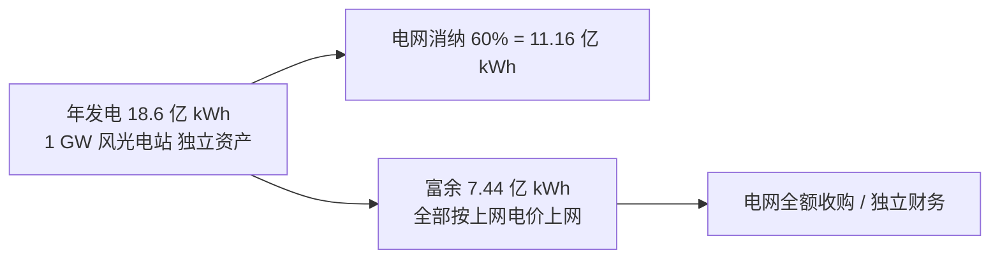
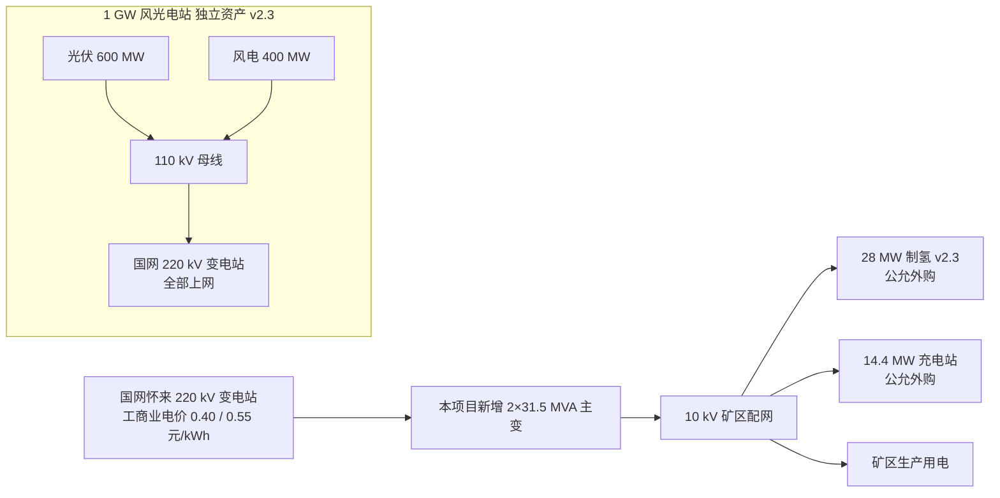

# 第 2 章 厂址、资源与既有资产 v2.3

> v2.3 关键变化：① **1 GW 风光电站出项目评价边界** —— 独立核算、不参与本项目财务评价；② 删除"富余电量小时级匹配制氢"叙事（v2.3 电氢完全分离）；③ 删除"富余制氢能力通过京藏/京新高速对外加氢"叙事（v2.3 不规划任何对外氢气销售）；④ 制氢厂房占地按 **28 MW** 规模更新；⑤ 电网接入方案由"本电站直供"改为"电网工商业公允外购"口径。

## 2.1 厂址条件

| 项目 | 内容 |
|---|---|
| 行政区划 | 河北省张家口市怀来县土木镇 |
| 详细地址 | 怀来欣翰林文化旅游开发有限公司东 700 米 |
| 经纬度 | 约 N 40.40°, E 115.51°（矿区中心点估算） |
| 海拔 | 约 540-720 m |
| 距京张高速最近匝道 | 约 5 km |
| 距怀来县政府 | 约 12 km |
| 距张家口市区 | 约 65 km |
| 距北京六环 | 约 95 km |

### 2.1.1 区位战略意义 v2.3

怀来位于京津冀核心交通节点，是张家口至北京方向重要枢纽。本项目落地后：

- 矿区运输全部为厂区内 + 短倒 + 200 km 中途运输，不涉及公共道路对外承运
- **【v2.3 已删除】通过京藏/京新高速覆盖对外加氢** —— 按 v2.3 业主指示不规划任何对外氢气销售
- 京张冬奥示范区（延庆/赤城）氢能场景持续扩大，本项目作为燃料电池汽车示范城市群 200 台推广任务的一环，对示范区建设形成辅助贡献（v2.3 仅作辅助参考，不参与主决策）

## 2.2 气候与自然条件

| 指标 | 数值 | 对项目影响 |
|---|---|---|
| 年均气温 | 8.1 ℃ | 冬季低温对 电动重卡 续航有显著影响 |
| 极端低温 | -22 ℃ | 氢能重卡 低温启动优势凸显 |
| 极端高温 | 38 ℃ | 储氢瓶组散热设计需校核 |
| 年日照时数 | 2,800-3,000 h | 光伏年利用 1,500 h（实际可利用） |
| 年均风速 | 3.5-4.5 m/s | 风电年利用 2,400 h |
| 年降水量 | 380-420 mm | 半干旱，水资源约束（制氢用水需重视） |
| 主导风向 | 冬西北、夏东南 | 加氢站防爆区设计依据 |

### 2.2.1 低温对配比的反向支持

冬季 -10 ℃ 以下时段（年约 1,000 h），电动重卡 续航普遍下降 20-30%，而 氢能重卡 受影响 < 8%。**冬季矿区出勤压力大、连续作业窗口长，进一步强化了主线工况采用 氢能重卡 的合理性**。

## 2.3 既有 1 GW 风光互补电站（v2.3 独立资产，出项目边界）

### 2.3.1 装机与发电能力（仅作背景信息呈现）

| 类型 | 装机 (MW) | 年利用小时 (h) | 年发电量 (亿 kWh) |
|---|---:|---:|---:|
| 光伏 | 600 | 1,500 | 9.0 |
| 风电 | 400 | 2,400 | 9.6 |
| 合计 | 1,000 | — | **18.6** |

> 数据来源：张家口可再生能源示范区典型工程统计、业主提供发电小时数。

### 2.3.2 电量消纳口径 v2.3（仅作信息呈现，不进入本项目评价）

> **v2.3 关键声明（红线）**：
>
> 1. 1 GW 风光电站为业主集团兄弟公司**独立核算资产**，其 18.6 亿 kWh 年发电量**全部上网（11.16 亿 kWh 电网消纳 + 7.44 亿 kWh 富余）**，**绝对不可用于本项目制氢**、**绝对不可用于扩展制氢规模**、**绝对不可用于矿区直供充电**
> 2. 本项目所需制氢电力（1.408 亿 kWh/年 v2.3 28 MW 系统）与电动重卡充电电力**一律按电网工商业电价 0.40 / 0.55 元/kWh 公允外购**
> 3. 风光电站与本项目之间**零交叉补贴**
> 4. 如业主/市场未来安排风光长协 PPA 向本项目供电，必须按**市场化独立合同**执行（绿证单独计入制氢 OPEX），不构成两者财务交叉

## 2.4 1 万亩储备建设用地

| 用途 | 占地（亩） | 占比 |
|---|---:|---:|
| 风光电站本体 | 6,500 | 65% |
| 矿山生产作业区 | 1,800 | 18% |
| **本项目可用** | **1,200** | **12%** |
| 道路与防护 | 500 | 5% |

### 2.4.1 本项目用地分配

| 设施 | 占地（亩） v2.3 | 备注 |
|---|---:|---|
| **28 MW 制氢厂房 + 电解槽配套设备 v2.3** | 95 | 含原水/碱液/压缩/储氢（v2.3 28 MW 降容 5 亩）|
| 加氢站 3 座 | 30 (3×10) | 含防爆区 |
| 充电站集结点 5 处 | 25 (5×5) | 含休息区 |
| 储能站（100 MWh 预留） | 60 | 锂离子或液流电池 |
| 配电与变电 | 15 | 含 110 kV 主变 |
| 综合管理楼/食宿 | 20 | |
| 道路与场地 | 70 | |
| **合计 v2.3** | **315** | 占可用储备地 26% |

> 剩余 885 亩可用于后续扩能。按 v2.3 原则，**扩能制氢规模仍按车队需求反推**，且**不规划对外氢气销售**。

## 2.5 矿权与采掘条件

- 矿权范围：完整矿权，位于矿区中心
- 矿种：新型石材原料（大理石/花岗岩复合）
- 设计年产能：约 1,800-2,000 万吨（含原矿与初加工）
- 采掘工艺：露天台阶式开采
- 主要工作面：3 个，分别位于厂区东、南、西方向
- 平均运距：从工作面至破碎站 4 km，从破碎站至加工厂/集运站 12 km

## 2.6 水资源条件

| 项目 | 数据 v2.3 | 对项目影响 |
|---|---|---|
| 用水来源 | 怀来县工业供水管网 + 矿区自有水库（5 万 m³） | 充足 |
| 制氢年用水量 v2.3 | ~ 47,900 m³（按 17 L/kg H₂ × 2,816 t）| 占当地工业用水比例 < 1% |
| 充电站冷却水 | 约 2,000 m³/年 | 可循环利用 |
| 道路抑尘水 | 现有矿区已配置 | 无新增 |
| 水权审批 | 县水利局已具备前置许可 | 不构成约束 |

## 2.7 电网接入与消纳

### 2.7.1 现状

- 1 GW 电站通过 4 条 110 kV 线路并入怀来 220 kV 变电站
- 当地电网消纳能力约 60%，限电时段集中在春秋季中午时段

### 2.7.2 本项目接入方案 v2.3

- 新增主变 2×31.5 MVA 110/10 kV，接入容量 63 MVA
- **v2.3 修订**：制氢负荷与充电负荷**一律从电网工商业电价公允外购**，不再表述为"本电站直供"
- 峰谷电价差利用：充电负荷优先谷电时段（**谷电 0.40 元/kWh**）
- 已与国网河北分公司预沟通，技术接入方案具备可行性

## 2.8 交通与外联

| 项目 | 描述 |
|---|---|
| 厂区主出入口 | 已建成，宽 12 m，承重 80 t |
| 距京张高速怀来匝道 | 约 5 km |
| 距怀来火车站 | 约 8 km |
| 厂内运输道路 | 现有矿山道路，宽 8-12 m，可承重 60 t |
| 设备运输条件 | 大件设备（电解槽、储罐）可经京张高速直达，无超限障碍 |

## 2.9 既有基础设施评估

| 项目 | 现状 | 是否复用 |
|---|---|---|
| 矿山道路 | 良好 | 复用 |
| 矿山供水 | 良好 | 复用 |
| 矿区办公楼 | 良好 | 复用 |
| 食堂宿舍 | 在建，预计 第1年 完工 | 复用（含本项目员工） |
| 矿山综合维修车间 | 良好 | 改造为新能源车维保中心 |
| 110 kV 升压站 | 已建成 | 接入扩容 |

## 2.10 本章小结 v2.3

厂址条件优越：

- **1 GW 风光电站作为独立资产存在**，其电量 v2.3 出项目评价边界，本项目按电网公允价外购电（0.40 / 0.55 元/kWh）；风光电站未来可通过**市场化 PPA**（独立合同）向本项目供电，但不构成财务交叉
- 1 万亩用地中可用于本项目的 1,200 亩裕量充足，**28 MW 制氢系统 v2.3 占用 315 亩**（较 v2.2 30 MW 方案减 15 亩）
- 矿权完整、矿山道路自有、水电气基础设施可复用
- **v2.3 删除对外辐射加氢能力相关战略价值**（不规划任何对外氢气销售）

资源约束几乎不构成限制，**项目 v2.3 总投资 5.45 亿元**（较 v2.2 5.62 亿进一步降本 0.17 亿，主要来自制氢系统从 30 MW 下调至 28 MW）——这是后续财务模型的一次性总投资基础。
