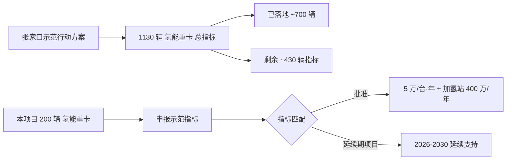

# 第 3 章 市场与政策环境

## 3.1 国家级政策框架

### 3.1.1 顶层规划

| 文件 | 发布机构 | 时间 | 关键要点 |
|---|---|---|---|
| 《氢能产业发展中长期规划（2021-2035）》 | 国家发改委、国家能源局 | 2022.03 | 明确氢能战略地位，鼓励"绿氢就近消纳" |
| 《关于开展氢能综合应用试点工作的通知》 | 财政部、工信部、国家发改委 | 2026.03 | 新增试点支持政策，规模化商业化推进 |
| 《新能源汽车产业发展规划（2021-2035）》 | 国务院 | 2020.10 | 重型货运纳入燃料电池示范重点 |
| 《"十四五"现代综合交通运输体系发展规划》 | 国务院 | 2022.01 | 重型货运、矿山运输绿色转型 |
| 《国家碳达峰行动方案》 | 国务院 | 2021.10 | 工业领域碳达峰要求 |

### 3.1.2 燃料电池汽车示范期奖励

国家对纳入示范城市群的燃料电池车辆按"以奖代补"方式发放：

- 按燃料电池系统功率计奖（基准 3,000 元/kW）
- 单台 氢能重卡（系统功率 130 kW）综合奖励可达 30 万元
- 张家口市级财政按 1:1 比例配套

### 3.1.3 新能源汽车购置税减免

- 2024-2025 年：电动重卡 购置税全免
- 2026-2027 年：电动重卡 购置税减半（上限 3 万元）
- 氢能重卡：购置税全免至 2027 年

## 3.2 河北省级政策

| 文件 | 时间 | 关键支持 |
|---|---|---|
| 《河北省氢能产业发展"十四五"规划》 | 2022.06 | 张家口、唐山、保定为氢能三大核心区 |
| 《河北省支持张家口建设国家级氢能示范区若干措施》 | 2022 | 省级配套补贴、产业引导基金 |

## 3.3 张家口市政策（核心相关）

### 3.3.1 《张家口市加快建设燃料电池汽车示范应用城市群行动方案》

- **实施期**：2021.12 - 2025.12（预期 2026-2030 进入第二阶段）
- **目标**：到 2025 年底推广 1,130 辆燃料电池汽车，建成 14 座加氢站，车用氢气终端售价降至 30 元/kg 以下
- **市级配套**：按中央财政奖励资金 1:1 比例配套

### 3.3.2 《张家口市支持建设燃料电池汽车示范城市的若干措施》

| 补贴项目 | 标准 | 限制条件 |
|---|---|---|
| 加氢站建设补贴 | 实际设备投资额的 20%，单座最高 400 万元 | 一次性 |
| 加氢站运营补贴 | 氢气供应价 ≤ 30 元/kg 时，每座年最高 400 万元 | 年度 |
| 中小型客车运营补 | 2 万元/台·年 | 需达标年里程 |
| 大型客车运营补 | 3 万元/台·年 | 需达标年里程 |
| 轻中型货车运营补 | 3 万元/台·年 | 需达标年里程 |
| **重卡运营补** | **5 万元/台·年** | **年均用氢里程 ≥ 7,500 km** |
| 关键零部件本地化补 | 按中央 1:1 配套 | 本地产业化 |

> 本项目 200 台 氢能重卡，按 5 万元/台·年 × 5 年示范期 = **5,000 万元**总运营补贴；加氢站 3 座按 400 万元/座·年 × 5 年 = **6,000 万元**。

### 3.3.3 张家口示范期延续展望

- 现行行动方案 2025 年底到期
- 据公开信息，张家口市正在编制 2026-2030 行动方案，氢能重卡仍为重点扶持方向
- 本报告基准情景按"示范期 5 年（即 第1年-第5年）"保守计入，悲观情景按 3 年，乐观情景按 7 年

## 3.4 怀来县级政策

- 怀来县属于张家口可再生能源示范区核心县
- 提供：土地使用绿色通道、电网接入绿色通道、环评/安评属地协调
- 县级财政尚无独立氢能补贴，但承担"示范区考核"压力，对本项目持高度欢迎态度

## 3.5 行业市场格局

### 3.5.1 氢能重卡市场（2026 一季度）

| 维度 | 数据 |
|---|---|
| 国内累计推广 | 约 18,000 辆 |
| 主流车型 | 49T 牵引车（占比 60%）、49T 自卸（占比 25%）、其他（15%） |
| 主流燃料电池系统功率 | 130-150 kW |
| 平均百公里氢耗 | 7.0-8.5 kg/100km |
| 招标限价区间 | 90-128 万元/台（公开招标）；批量直采价（业主 v2.0 锚定）= **30 万元/台**（裸车不含国补、车载储氢系统按目录单列） |
| 头部供应商 | 福田欧曼/福田智蓝、东风柳汽、陕汽德龙、宇通、亿华通 |
| 储氢瓶数量 | 8-10 瓶 @ 70 MPa，总质量 60-70 kg |
| 续航里程 | 500-700 km |
| 加注时间 | 8-15 分钟 |

### 3.5.2 纯电重卡市场（2026 一季度）

| 维度 | 数据 |
|---|---|
| 国内累计推广 | 约 110,000 辆 |
| 主流车型 | 49T 牵引（占比 45%）、49T 自卸（占比 40%）、矿用宽体（15%） |
| 主流电池容量 | 350-450 kWh |
| 平均百公里电耗 | 130-160 kWh/100km（49T 重载） |
| 价格区间 | 100-200 万元/台（裸车含电池） |
| 车电分离裸车价 | 47-65 万元/台 |
| 头部供应商 | 中国重汽 HOWO、陕汽德龙、解放、东风、徐工、三一 |
| 续航里程 | 200-400 km |
| 充电方式 | 480-600 kW 液冷超充，30-60 分钟 80% |
| 换电方式 | 5-10 分钟，需配套换电站 |

### 3.5.3 电解槽市场（2026 一季度）

| 维度 | 碱性 (碱性电解槽) | 质子交换膜电解槽 |
|---|---|---|
| 国内市场份额 | 75% | 18% |
| 单 MW 价格区间 | 500-650 万元/MW | 800-1,200 万元/MW |
| 电耗水平 | 4.5-4.8 kWh/Nm³ | 4.6-5.0 kWh/Nm³ |
| 启停响应 | 慢（10-30 分钟） | 快（< 1 分钟） |
| 最低负载率 | 25-40% | 5-10% |
| 寿命 | 8-15 年 | 6-10 年 |
| 适用场景 | 大规模、稳定负荷 | 风光波动、调峰 |

### 3.5.4 加氢站市场

| 维度 | 数据 |
|---|---|
| 国内已建加氢站 | 约 540 座 |
| 1,000 kg/天 35 MPa 标准站建造成本 | 1,800-2,500 万元 |
| 1,000 kg/天 70 MPa 站 | 2,500-3,500 万元 |
| 现行氢气终端价 | 35-65 元/kg（地区差异大，张家口示范区已降至 30 元以下） |

## 3.6 替代能源价格趋势

| 能源 | 2026 当前价 | 2030 预测 | 趋势 |
|---|---|---|---|
| 柴油（怀来加油站） | 7.30-7.80 元/L | 7.5-9.0 元/L | 上行（地缘+碳成本） |
| 工业用电（怀来） | 0.55-0.70 元/kWh | 维持/微降 | 平 |
| 谷电（22:00-06:00） | 0.40-0.50 元/kWh | 维持 | 平 |
| 自发自用绿电边际成本 | 0.18-0.22 元/kWh | 维持/微降 | 微降 |
| 制氢成本（自发自用绿氢） | 18-25 元/kg | 15-18 元/kg | 下行 |
| 国家核证碳减排 碳价 | 60-100 元/t | 100-200 元/t | 上行 |

## 3.7 碳市场

### 3.7.1 全国碳市场（全国碳市场配额）

- 启动：2021 年 7 月
- 行业覆盖：发电（2021）→ 钢铁、水泥、化工、电解铝（2025 年扩围）
- 矿区运输属间接覆盖（通过供应链 Scope 3）

### 3.7.2 自愿减排市场（国家核证碳减排）

- 重启：2024 年 1 月
- 方法学：当前已发布 9 个，覆盖造林、风光、并网光热等
- 预期 2026-2027 将新增"重型车辆电动化/氢能化"方法学，本项目可申报

### 3.7.3 国际接轨

- 欧盟 欧盟碳关税（2026 全面实施）将带动 国家核证碳减排 价格中长期上行
- 中国-欧盟碳市场互认正在谈判，预期 2027 年后部分领域互认

## 3.8 张家口示范任务的项目对接路径

## 3.9 政策风险与应对

| 风险 | 概率 | 影响 | 应对 |
|---|---|---|---|
| 示范期补贴退坡幅度大于预期 | 中 | 净现值 -3,000 万 | 第1年-第5年 集中投入与建设，最大化在示范期内的回收 |
| 示范期截止后无延续 | 低 | 净现值 -2,500 万 | 提前申请国家级氢能综合应用试点，承接政策接力 |
| 加氢站建设补贴上限下调 | 低 | 一次性总投资 增 800 万 | 锁定 2026 三季度 前完成核准并启动建设 |
| 国家核证碳减排 方法学迟于预期发布 | 中 | 净现值 -1,200 万 | 改用绿色信贷利率优惠对冲 |
| 购置税减免政策提前结束 | 低 | 一次性总投资 增 600 万 | 加快采购节奏，争取在 2027 年内完成主体采购 |

## 3.10 本章小结

国家、河北、张家口三级政策构成"叠加红利"：燃料电池示范期奖励（30 万/台 × 200 = 6,000 万）+ 张家口运营补（5 万/台·年 × 200 × 5 = 5,000 万）+ 加氢站补（400 万/年/座 × 3 × 5 = 6,000 万）合计 **示范期内约 1.7 亿元**政策资金，对项目 5.62 亿元投资构成 30% 的强力支撑。

市场上车辆、电解槽、加氢站三类核心设备价格均处于"经济性临界点"，技术与商业化条件成熟。**政策与市场共振，构成本项目的最佳启动窗口期**。
