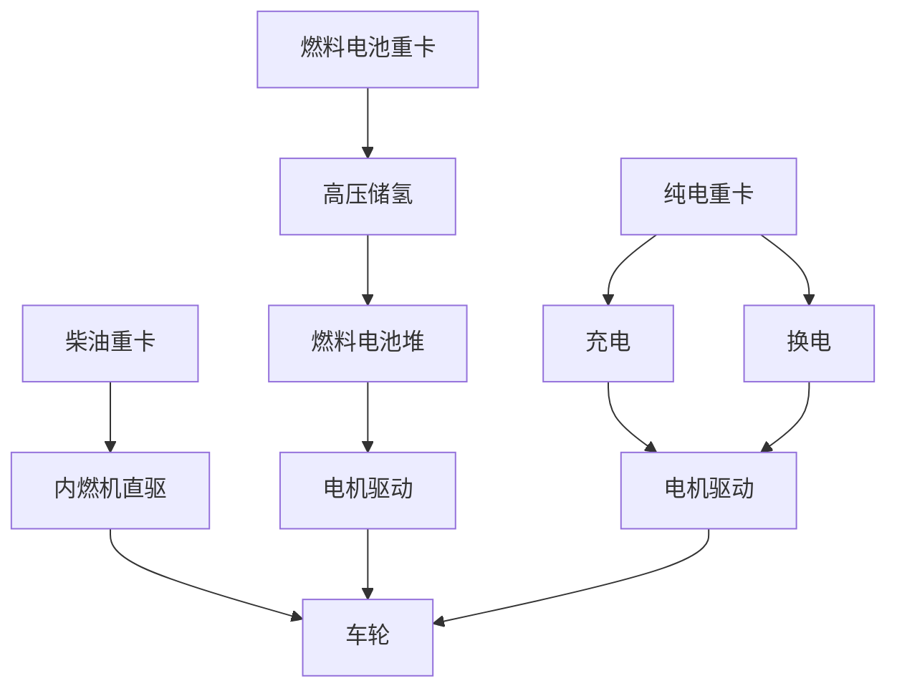

# 第 4 章 技术路线对比

## 4.1 重型货运三大技术路线综述

## 4.2 三大路线技术对比

| 维度 | 柴油 | 电动重卡（49吨） | 氢能重卡（49吨） |
|---|---|---|---|
| 动力来源 | 柴油 | 锂电池 | 高压氢气 + 燃料电池堆 |
| 单耗 | 35 L/100km | 145 kWh/100km | 7.5 kg H₂/100km |
| 续航里程 | 800-1,200 km | 200-400 km | 500-700 km |
| 补能时间 | 5-8 分钟 | 充电 30-60 分/换电 5-10 分 | 8-15 分钟 |
| 低温启动 | 优 | 差（-20℃ 性能下降 30%） | 优（带冷启动模块） |
| 重量影响 | 整车较轻 | 电池占重 ~3.5 t | 储氢瓶+堆 ~1.5 t |
| 维护复杂度 | 高（发动机+变速箱） | 低（电机+电控） | 中（堆+空压机+水管理） |
| 寿命 | 80-100 万 km | 60-100 万 km | 80-120 万 km |
| 残值率 | 15% (10 年) | 8% (10 年) | 10% (10 年) |
| 全生命周期 排放 | 108.5 kgCO₂/100km | 8-30 kgCO₂/100km（绿电下限） | 0.4-3.7 kgCO₂/100km（绿氢下限） |

## 4.3 电动重卡 技术深度评估

### 4.3.1 优势

1. **能源效率高**：电池→电机直驱效率约 85%，远高于燃料电池的 50-55%
2. **基础设施简单**：充电桩部署快、维护门槛低
3. **谷电匹配性好**：22:00-06:00 谷电时段可低成本补能
4. **维保成本低**：无液体工质、运动部件少
5. **技术成熟度高**：国内累计 11 万辆运营经验

### 4.3.2 劣势与适用边界

1. **续航受限**：49T 重载工况下实际续航 200-300 km，不适合连续主线运输
2. **充电时间瓶颈**：480 kW 超充 30 分钟仅充 80%，对高出勤率敏感
3. **低温性能衰减**：怀来冬季 -20℃ 极端气温下续航下降 30%
4. **电池成本占整车 40%**：5-6 年需做电池中修/延寿
5. **充电峰值压力**：100 台同时充电峰值约 14 MW，对电网友好性差
6. **换电模式需配套**：换电站投资 3,000-5,000 万元/座，重资本

### 4.3.3 适用工况判定

- **强适用**：固定路线、可计划性强、低出勤要求、4-8 km 短倒、谷电充足
- **弱适用**：连续作业、长续航需求、高峰冬季、跨区运输

## 4.4 氢能重卡 技术深度评估

### 4.4.1 优势

1. **快速加注**：8-15 分钟与柴油加油接近，出勤率不受补能时间限制
2. **长续航**：单次加氢 500-700 km，覆盖矿区双班作业全程
3. **低温启动优秀**：-30℃ 冷启动可实现，续航下降 < 8%
4. **载荷优势**：储氢瓶+堆比电池轻 2 t，载货能力提升约 5%
5. **模块化设计**：燃料电池堆+储氢瓶易于维护更换
6. **副产品价值**：水副产品可回收利用

### 4.4.2 劣势与适用边界

1. **能源效率较低**：风光→电解→压缩→堆→电机综合效率约 30-35%
2. **燃料电池堆成本占整车 35-40%**：5 年需中修 15 万元
3. **依赖加氢基础设施**：需配套加氢站
4. **氢气来源敏感**：灰氢 对比 蓝氢 对比 绿氢 全生命周期碳排差异极大
5. **储氢压力高**：35/70 MPa 安全管理要求严
6. **国内规模化运营经验相对较少**：1.8 万辆 对比 电动重卡 11 万辆

### 4.4.3 适用工况判定

- **强适用**：连续作业、长续航需求、低温频发、高出勤率、矿区/重型货运
- **弱适用**：固定短倒（虽可用但浪费长续航优势）

## 4.5 综合评分对比

> 评分标准：1-10 分，10 为最优；权重根据矿区运输实际优先级设定。

| 维度 | 权重 | 柴油 | 电动重卡 | 氢能重卡 |
|---|---:|---:|---:|---:|
| 单 km 经济性（基准 制氢成本 18 元） | 20% | 5 | 8 | 8 |
| 出勤可控性 | 18% | 9 | 6 | 9 |
| 长续航适配 | 15% | 9 | 5 | 9 |
| 低温适应 | 10% | 9 | 6 | 9 |
| 载荷与运能 | 10% | 8 | 7 | 8 |
| 减碳与 环境社会治理 | 10% | 1 | 8 | 9 |
| 政策红利 | 8% | 2 | 7 | 10 |
| 维保便利性 | 5% | 6 | 9 | 7 |
| 基础设施成熟度 | 4% | 10 | 9 | 5 |
| **加权总分** | 100% | **6.07** | **6.92** | **8.50** |

## 4.6 工况-车型适配矩阵

| 工况 | 氢能重卡 | 电动重卡 | 柴油 | 推荐 |
|---|:---:|:---:|:---:|---|
| 主线长倒 12 km × 8 趟（双班 192 km/天） | ✓✓ | ✓ | ✓ | **氢能重卡** |
| 矿场短倒 4 km × 18 趟（144 km/天） | ✓ | ✓✓ | ✓ | **电动重卡** |
| 冬季 -20℃ 极端工况 | ✓✓ | △ | ✓ | **氢能重卡** |
| 24 小时连续作业 | ✓✓ | △ | ✓ | **氢能重卡** |
| 计划性高的厂区调度 | ✓ | ✓✓ | ✓ | **电动重卡** |
| 矿区外承运（潜在） | ✓✓ | △ | ✓ | **氢能重卡** |

> ✓✓ 强匹配；✓ 一般匹配；△ 边缘适用

## 4.7 关键技术指标横向对标（国内外标杆）

| 维度 | 国内标杆 | 国际领先 | 本项目目标 |
|---|---|---|---|
| 氢能重卡氢耗 | 北汽 H49: 7.1 kg/100km | Hyundai Xcient: 7.0 kg/100km | 7.5 kg/100km |
| 电动重卡电耗 | 中国重汽 HOWO: 145 kWh/100km | Tesla Semi: 130 kWh/100km | 145 kWh/100km |
| 碱性电解槽电耗 | 中国 Cockerill 等: 4.5 kWh/Nm³ | NEL: 4.2 kWh/Nm³ | 4.5 kWh/Nm³ |
| 加氢站建造成本 | 国内: 2,000-2,500 万/座 | 美国: 1,500-2,000 万/座 | 2,500 万/座 |
| 制氢成本（绿氢） | 国内最优: 16-22 元/kg | 中东光伏氢: 12-18 元/kg | 18.2 元/kg |

## 4.8 技术路线选型决策

基于综合评分（氢能重卡 8.50 > 电动重卡 6.92 > 柴油 6.07）与工况适配矩阵：

> **决策结论**：采用 **氢能重卡 + 电动重卡 混合路线**，配比 **200 + 100**（2:1）。
>
> - 主线长倒采用 氢能重卡
> - 矿场短倒采用 电动重卡
> - 全队完全替代柴油
> - 充分发挥两种路线在各自最优工况下的经济与运营优势

## 4.9 风险性技术对比

| 风险 | 柴油 | 电动重卡 | 氢能重卡 |
|---|---|---|---|
| 燃烧/爆炸 | 中（柴油闪点 50-90℃） | 中（电池热失控） | 高（氢气低着火能） |
| 触电 | 低 | 中 | 中 |
| 高压气体 | 无 | 无 | 高（35-70 MPa 储氢） |
| 电池水浸 | 无 | 中 | 低 |
| 极端温度 | 低 | 高（-20℃ 性能衰减） | 低 |
| 加注/充电安全 | 低 | 中（高压充电） | 高（氢气泄漏） |

> **结论**：氢能重卡 安全风险等级"高"主要源于氢气物理特性，但**通过严格遵守 GB 17681、GB/T 31138、GB/T 26779 等国家标准 + 加氢站防爆区设计 + 智能监控系统可有效控制**。本项目设有专项 健康安全环保 章节（11.3）。

## 4.10 本章小结

本章通过技术成熟度、运营效率、安全性、经济性、政策性五维度对比，得出以下核心结论：

1. **柴油路线已不具备竞争力**：碳成本、政策反向、运营成本三重压力下不可持续
2. **电动重卡 与 氢能重卡 各有优势工况**：单一路线难以覆盖矿区全部需求
3. **混合路线（2:1）是最优解**：兼顾工况、经济性、风险分散与政策红利

> **第 4 章决策已锁定 → 第 8 章将在此基础上通过 模型 04 完成数学求解，给出 200 氢能重卡 + 100 电动重卡 的单点最优配比。**
