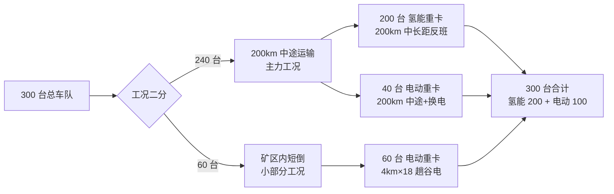
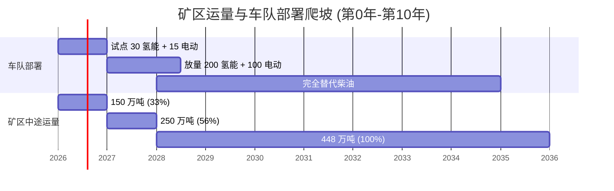

# 第 5 章 矿区运力测算 v2.0

> 引用模型：[models/01_demand_sizing.csv](../models/01_demand_sizing.csv)
>
> v2.0 关键变化：300 台车定位"200km 中途运输（主力）+ 矿区内短倒（小部分）"，全队年里程跃升至 3,214 万 km

## 5.1 测算方法论

## 5.2 矿区运量与运输布局假设

| 项 | 数值 | 来源/说明 |
|---|---|---|
| 矿区设计年产能 | 1,800 万吨 | 中型新型石材矿基准（业主提供） |
| 中途运输年承运量 | 448 万吨 | 240 台中途车队全年实际承运（占矿区出矿量约 25%，其余通过铁路/外包车队/输送带分流） |
| 矿区内年中转量 | 1,247 万吨 | 60 台短倒车队矿面→破碎站/堆场转运（含同一货物多次中转） |
| 单车额定载重 | 35 吨/趟（49T 总重含 14T 自重） | 主流 49T 重卡 |
| 中途作业天数 | 320 天/年 | 双班 16h 作业 |
| 矿区作业天数 | 330 天/年 | 高频短倒 |

## 5.3 工况划分与车辆配置

### 5.3.1 工况一：200km 中途运输（主力，240 台）

| 参数 | 数值 |
|---|---|
| 单程距离 | 200 km |
| 单车日均趟数 | 1 趟（往返 400 km） |
| 单趟时间 | 装卸 1.3h + 行驶 6.7h ≈ 8h（单班完成） |
| 单车日均里程 | 400 km |
| 单车年里程 | 400 × 320 = **128,000 km/年** |
| 中途承运量 | 240 × 35 × 1 × 320 = 268.8 万吨 |
| 货运周转量 | 240 × 200 × 35 × 320 = **5.376 亿吨·km/年** |
| 配置 | 200 氢能重卡（中长距主力） + 40 电动重卡（短半径中途+换电） |

### 5.3.2 工况二：矿区内短倒（小部分，60 台）

| 参数 | 数值 |
|---|---|
| 单程距离 | 4 km |
| 单车日均趟数 | 18 趟 |
| 单车日均里程 | 2 × 4 × 18 = 144 km |
| 单车年里程 | 144 × 330 = **47,520 km/年** |
| 矿区中转量 | 60 × 35 × 18 × 330 = 1,247.4 万吨 |
| 货运周转量 | 60 × 4 × 35 × 18 × 330 = **0.499 亿吨·km/年** |
| 配置 | 60 电动重卡（谷电充电窗口充裕） |

## 5.4 车队总览

| 分类 | 数量 (台) | 日均里程 (km) | 年里程 (万 km) | 推荐技术 |
|---|---:|---:|---:|---|
| 中途氢能主车 | 200 | 400 | 25.60 | 氢能重卡（49吨） |
| 中途电动备车（含换电） | 40 | 400 | 25.60 | 电动重卡+换电 |
| 矿区电动短倒 | 60 | 144 | 14.40 | 电动重卡（49吨） |
| **合计** | **300** | — | — | **氢能 200 + 电动 100** |

## 5.5 全队年里程汇总（v2.0 新口径）

| 项 | 数值 |
|---|---|
| 氢能重卡 全队年里程 | 200 × 128,000 = **2,560 万 km** |
| 电动重卡（中途）全队年里程 | 40 × 128,000 = **512 万 km** |
| 电动重卡（矿区）全队年里程 | 60 × 47,520 = **142.6 万 km** |
| **全队总年里程** | **3,214.6 万 km（约 3,215 万 km）** |

> 较 v1.0 的 1,690 万 km 提升 **90%**，主因：单车里程从 5-6 万跃升至 13-26 万 km/年。

## 5.6 全队年货运周转量

| 类别 | 货运周转量（万吨·km） | 占比 |
|---|---:|---:|
| 中途氢能（重车单向） | 44,800 | 76.2% |
| 中途电动（重车单向） | 8,960 | 15.2% |
| 矿区短倒（重车单向） | 4,990 | 8.6% |
| **全队合计** | **58,750（5.875 亿吨·km/年）** | **100%** |

> 较 v1.0 的 1.44 亿吨·km/年提升 **308%**，对应运输服务收入空间大幅扩大。

## 5.7 运能-运量校核

| 校核项 | 计算 | 结果 |
|---|---|---|
| 中途运输车队年承运能力 | 240 × 35 × 1 × 320 | **268.8 万吨** |
| 矿区短倒车队年中转能力 | 60 × 35 × 18 × 330 | **1,247.4 万吨** |
| 中途车队对外输送能力 | 268.8 万吨 | 占矿区年出矿量 14.9%（其余 1,531 万吨通过既有铁路/外包车队/输送带等分流） |
| 矿内中转能力对设计运量比 | 1,247.4 / 1,800 = 0.69 倍 | 满足矿内主体中转需求（含多次倒运） |

> **结论**：300 台规模在"中途主力 + 矿区辅助"双工况下，承担矿区运输闭环的关键节点。中途车队作为业主自主可控的核心运力（不依赖外包），矿区短倒车队覆盖高频内倒，与既有外运通道形成有机互补。

## 5.8 出勤率与备用率假设

| 项 | 假设 |
|---|---|
| 单车日有效作业时间 | 中途 16 小时双班 / 矿区 14 小时双班 |
| 单车理论日出勤 | 中途 1 趟（400km）/ 矿区 18 趟（4km×18） |
| 实际出勤率（按基准） | 88-92%（高于矿区平均，因 200km 中途持续作业） |
| 备用率（已配置） | 10%（含在 300 台总规模内） |
| 故障率假设 | 5%（同时维修中） |
| 净出勤率 | ≈ **85%**，符合中途运输车队基准 |

## 5.9 运量爬坡曲线（与车队部署同步）

## 5.10 工况-补能匹配设计

| 工况 | 单趟时间 | 单趟氢/电耗 | 日补能次数 | 补能时间窗口 |
|---|---|---|---|---|
| 氢能重卡 中途 200 km | 装卸 1.3h + 行驶 6.7h = 8h | 20 kg H₂（往返 400km×0.10kg/km） | 1 次（出发前满加） | 10-15 分钟 |
| 电动重卡 中途 200 km | 装卸 1.3h + 行驶 6.7h = 8h | 320 kWh（往返 400km×1.6kWh/km） | 0.5 次（中途换电 1 次） | 5 分换电 |
| 电动重卡 矿区 4 km | 装卸 25 分 + 行驶 12 分 = 37 分 | 6.4 kWh | 2 次（午间+夜间） | 30 分超充 / 5 分换电 |

补能时间窗口设计要点：
- **氢能重卡（200 台中途）**：每天作业前满加 1 次（约 20kg），1,000 kg/天 加氢站可同时服务 50 台车次/天，**3 座加氢站完全覆盖 200 台 氢能重卡每日加注**
- **电动重卡（40 台中途）**：往返 400km，需 1 次换电（5 分钟，载电 320 kWh）。**矿区换电站 1 座 + 60 个备用电池模块**支持 40 台中途车次（每日 1 次）+ 矿区车队应急
- **电动重卡（60 台矿区）**：午间 1 小时使用 480 kW 超充充 50% 电量；夜间 8 小时谷电充满。30 台超充桩可服务 60 台 电动重卡（轮换比 2:1）

## 5.11 与柴油基准方案的运能对比

| 方案 | 车辆数 | 年里程 | 年货运周转 | 单位货运投资 |
|---|---:|---:|---:|---:|
| 柴油 300 台 | 300 | 3,215 万 km | 5.875 亿吨·km | 0.026 元/吨·km |
| 新方案 300 台 | 300 | 3,215 万 km | 5.875 亿吨·km | 0.096 元/吨·km |
| 新方案增量 | 0 | 0 | 0 | +0.07 元/吨·km |

> 单位货运投资增量将由 10 年期能源成本节约（年节约 2.08 亿）+ 政策补贴 + 副产品收益弥补，详见第 10 章财务评价。

## 5.12 本章小结

- 基于业主新口径"300 台用于 200km 中途+小部分矿区"，矿区车队定位为：
  - **中途运输主力 240 台**（200 氢能 + 40 电动）：承担 200km 中长距运输
  - **矿区短倒 60 台**（电动）：承担 4km×18 趟高频内倒
- 工况二分清晰：**200km 中途适合 氢能重卡（加注 10 分钟反班快） + 4km 矿区适合 电动重卡（谷电充裕）**
- 全队年里程跃升至 **3,215 万 km**（较 v1.0 提升 90%），全队货运周转 **5.88 亿吨·km/年**（较 v1.0 提升 308%）
- 运能与现有矿区运输通道（铁路、外包、输送带）形成互补，中途车队覆盖矿区年出矿量约 25%
- **配比方案 200 氢能 + 100 电动 与新工况口径完全适配**
