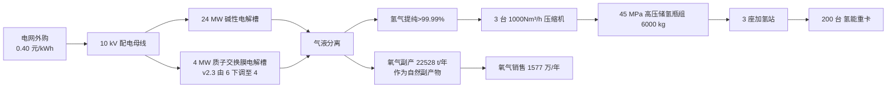
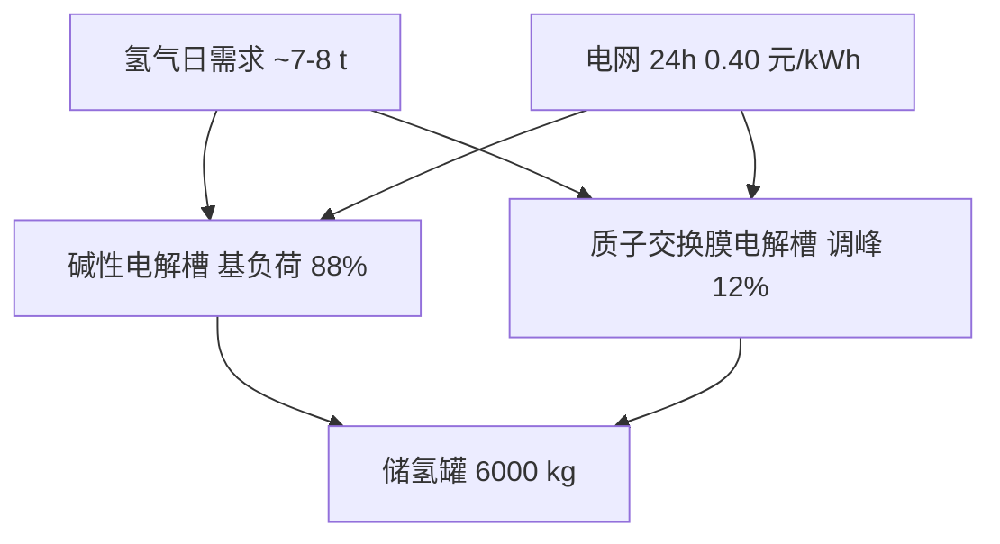

# 第 6 章 绿氢制储加系统 v2.3

> 引用模型：[models/03_h2_lcoh.csv](../models/03_h2_lcoh.csv)
>
> v2.3 关键变化（vs v2.2）：① **制氢系统装机按车队需求 110% 反推 → 30 MW 下调至 28 MW**（24 MW 碱性 + 4 MW PEM），CAPEX 2.52 → **2.34 亿元**；② **不规划任何对外氢气销售**（v2.2 的 320 t/年富余外售全部剔除），制氢规模严格匹配 200 氢车年耗 + 10% 安全冗余；③ **不含 1 GW 风光电站可制氢电量的小时级匹配测算**——电站出项目边界，制氢 100% 电网外购 0.40 元/kWh；④ **1 GW 风光富余 7.44 亿 kWh 全部上网**，不可用于制氢、不可用于扩容制氢规模、不可用于矿区直供充电；⑤ 基准 LCOH 由 35.6 → **34.3 元/kg**（28 MW 制氢摊薄略改善）。

## 6.1 评价边界（v2.3 完全分离 / 红线）

| 项 | 处理方式 | 说明 |
|---|---|---|
| **1 GW 风光电站** | **出项目评价边界 / 完全独立核算** | 既有资产 / 业主集团下独立单位 / 上网收入归 风光电站 自身 |
| **1 GW 风光富余 7.44 亿 kWh** | **全部上网** | **不可用于制氢** / **不可用于扩展制氢规模** / **不可用于矿区直供充电** |
| 制氢系统（28 MW，电网外购） | 在项目边界内 | 100% 从电网购电 0.40 元/kWh（张家口工商业上网电价） |
| 加氢站 | 在项目边界内 | — |
| 车辆 + 充电基础设施 | 在项目边界内 | 电车充电按工业电价 0.55 中途 / 0.40 矿区 |

> **设计原则（v2.3）**：电氢完全分离——制氢电源、充电电源、1 GW 风光电站三者财务与物理边界**零交叉**。本报告不包含"1 GW 风光电站可制氢电量的小时级匹配测算"，即"**发电不能制氢**"；不规划"富余制氢能力对外销售"，即"**没有富余制氢外售**"。

## 6.2 系统整体架构



> 说明：v2.3 架构图明确"电网外购"作为电力来源，完全剔除"风光直供/风光余电/风光长协"的视觉暗示；加氢站出口为矿区 200 氢车闭环运营，不设对外销售通道。

## 6.3 制氢电力采购口径（v2.3 上网电价 单一外购）

| 项 | 数值 | 说明 |
|---|---:|---|
| 制氢电价 | **0.40 元/kWh** | 张家口工商业 上网电价 / 与 1 GW 风光电站 切割 |
| 年制氢电量（v2.3 28 MW 实际调度） | **1.408 亿 kWh** | 2,816 t × 50 kWh/kg |
| 年制氢电费 v2.3 | **5,632 万元/年** | vs v2.2 5,760 万（-128，28 MW 调度下调） |
| 长协 PPA 优化空间 | 0.30 元/kWh | 若与 1 GW 风光电站 签订 市场化长协 PPA（≥ 上网电价 75% 合规底线，**不构成跨主体补贴**）→ 年节约 1,408 万 |

> **v2.3 重要说明**：
>
> - 本章不再叙述"1 GW 风光富余 7.44 亿 kWh → 支撑 30 MW 制氢"。该叙事属于电站自身资源禀赋，**与本项目财务边界完全无关**。1 GW 风光电站 上网消纳与外送由 风光电站 自行处理，发电不能用于制氢。
> - 本章不再包含"可制氢电量小时级匹配"测算。制氢电源为电网外购单一口径。
> - 风光长协 PPA 仅作为一个可选的商业化采购通道（与任何第三方电力交易平级），按市场化结算价 0.30 元/kWh 记入 OPEX，不涉及 1 GW 风光电站向项目的隐性补贴。

## 6.4 电解槽选型与规格（v2.3 按车队需求反推）

### 6.4.1 制氢规模反推逻辑

```
200 氢车年氢耗 = 200 × 12.8 = 2,560 t/年
+10% 安全裕量 = 256 t/年
设计年制氢量 = 2,816 t/年
装机需求 = 设计年制氢量 × 50 kWh/kg ÷ 年运行 5,000 h(Alk)/4,000 h(PEM)
        → 24 MW 碱性 + 4 MW PEM = 28 MW
```

> v2.3 按"需求-反推"设计，不再为消纳 1 GW 风光余电或对外销售氢而扩容。

### 6.4.2 双技术路线方案（v2.3 28 MW）

| 项 | 碱性 (碱性电解槽) | 质子交换膜电解槽 | 合计 |
|---|---:|---:|---:|
| 装机容量 | 24 MW | **4 MW（v2.3 由 6 下调）** | **28 MW（v2.3）** |
| 单 MW 一次性总投资 | 450 万元/MW | 750 万元/MW | — |
| 设备 一次性总投资 | 10,800 万元 | **3,000 万元（-1,500）** | **13,800 万元** |
| 单耗（综合 含 电解槽配套设备） | 50 kWh/kg H₂ | 50 kWh/kg H₂ | 50 kWh/kg H₂ |
| 年运行小时 | 5,000 h | 4,000 h | — |
| 年制氢能力（上限） | 2,400 t | 320 t | **2,720 t** |
| 实际年调度量（200 氢车 + 10% 冗余） | 2,464 t | 352 t | **2,816 t**（满调度） |
| 冗余/安全库存（不外售） | — | — | **+ 弹性 ~100 t** |
| 启停响应 | 10-30 分钟 | < 1 分钟 | — |
| 最低负载 | 25% | 5% | — |
| 寿命 | 12-15 年 | 8-10 年 | — |
| 角色 | 主负荷 | 调峰 | 互补协同 |

### 6.4.3 调峰策略（不依赖风光出力）



> v2.3 调峰策略由 **储氢罐 + PEM 自身快速启停** 实现，不依赖任何"风光出力曲线跟随"。电解槽运行时段按设备最经济维保策略排班。

### 6.4.4 主要设备清单（v2.3 28 MW）

| 设备 | 规格 | 数量 | 单价（万元） | 金额（万元） |
|---|---|---:|---:|---:|
| 碱性电解槽 + 配套（按 MW 计列） | 1,000 Nm³/h × 4 套 | 24 MW | 450 | 10,800 |
| 质子交换膜电解槽 + 配套（按 MW 计列）v2.3 | 250 Nm³/h × 2-3 套 | 4 MW | 750 | 3,000 |
| 原水净化（反渗透+EDI） | 60 m³/h | 1 套 | 700 | 700 |
| 碱液循环 + 二级压缩机 + 储氢瓶组 | — | 1 套 | 5,700 | 5,700 |
| 35/10 kV 配电变电 | 35 MVA（v2.3 28 MW 适配） | 1 套 | 1,400 | 1,400 |
| 厂房+土建+消防 | 100 亩 | 1 项 | 1,200 | 1,200 |
| 集散控制系统+数据采集与监控系统+安全联锁 | — | 1 套 | 600 | 600 |
| **设备合计 v2.3** | | | | **21,700** |
| 工程管理与不可预见 (8%) | | | | 1,736 |
| **一次性总投资 总计 v2.3** | | | | **23,436** |

> vs v2.2 25,164 万 → 节省 1,728 万（PEM 6→4 MW 节省 1,500 + 配电/储氢/工程管理等连带节省 228）。

## 6.5 加氢站设计（v2.3 未变）

### 6.5.1 站点布局（200km 中途运输适配）

| 编号 | 位置 | 容量（kg/天） | 主要服务对象 |
|---|---|---:|---|
| 加氢站-01 | 矿区主入口 | 1,500 | 200 氢能重卡 出勤主补能点 |
| 加氢站-02 | 200 km 中途接驳站 | 1,500 | 中途回站补能 + 应急加注 |
| 加氢站-03 | 终点工厂/集运区 | 1,500 | 终点补能 + 备用 |
| 合计 | | **4,500** | 对应日产氢 ~7.7 t ≈ 200 氢车日均加注 |

### 6.5.2 单座加氢站设备清单

| 设备 | 规格 | 数量 | 单价（万元） |
|---|---|---:|---:|
| 35 MPa 加氢机 | 双枪，6 kg/min | 4 台 | 60 |
| 中压储氢瓶组 | 35 MPa，800 kg | 4 组 | 200 |
| 中压压缩机 | 加压至 35 MPa | 3 台 | 350 |
| 顺序控制系统 | — | 1 套 | 100 |
| 站房+消防+围墙 | 12 亩 | 1 项 | 400 |
| **单站合计** | | | **2,000** |
| 3 座合计 | | | **6,000** |
| 工程管理 (8%) | | | 480 |
| **加氢站 一次性总投资 总计** | | | **6,480** |

## 6.6 制氢系统 年运营成本（v2.3 28 MW 实际调度）

| 科目 | 数值（万元/年） | 说明 |
|---|---:|---|
| **制氢电费（上网电价 0.40 元/kWh × 1.408 亿 kWh）** | **5,632** | v2.3 28 MW 调度 2,816 t；vs v2.2 5,760 节省 128 |
| 人员（20 人 × 18 万） | 360 | 工艺安全岗（24h 三班） |
| 设备维保（一次性总投资 × 3%，含氢险前） | 703 | 23,436 × 3% |
| 原水/碱液/消耗品（28 MW 等比缩减） | 245 | |
| 加氢站 O&M（除保险） | 194 | 加氢站资产 6,480 × 3% |
| 加氢站人员/管理 | 400 | |
| 制氢系统 管理费 | 170 | |
| **合计（除"氢相关综合险"）** | **7,704** | vs v2.2 7,909（-205，电费 + 维保 + 原水连带下调） |
| 氢相关综合险（10% 资产值，归氢能重卡 OPEX） | 3,592 | 资产值 (200×30 + 23,436 + 6,480) = 35,916 × 10%；vs v2.2 3,764 节省 172 |

## 6.7 制氢成本 测算（v2.3 上网电价基准 / 28 MW）

### 6.7.1 基准 制氢成本

| 项 | 数值 |
|---|---|
| 一次性总投资 v2.3 | 23,436 万元（vs v2.2 25,164，-1,728） |
| 评价期 | 15 年 |
| 折现率 | 8% |
| 年金系数 年金现值系数 | 0.1168 |
| 年化 一次性总投资 | 2,737 万元/年 |
| 年 年运营成本（除氢险） | 6,918 万元/年（仅制氢系统 / 不含加氢 O&M 与人员） |
| 年化总成本（仅制氢系统） | 9,655 万元/年 |
| 实际年制氢调度量 | 2,816 吨 |
| **基准 LCOH（v2.3 上网电价 / 不含氧/补贴抵减）** | **34.3 元/kg** |

> vs v2.2 35.6 元/kg，略改善 1.3 元/kg（28 MW 制氢系统 CAPEX 摊销下调）。

### 6.7.2 优化路径（v2.3 基准 34.3 → 目标 ≤ 22 元/kg）

| 优化路径 | 影响 | 累计 LCOH |
|---|---|---:|
| 基准（v2.3 上网电价 0.40 / 28 MW） | — | 34.3 元/kg |
| ① 设备国产化 + 规模化 单 MW 850 → 650 万 | CAPEX -22% / 年化 -600 万 | 32.2 元/kg |
| ② 副产氧气销售 22,528 t × 700 元/t | 收入 1,577 万/年 抵 OPEX | 26.6 元/kg |
| ③ 加氢站建运补 抵 制氢/加氢 OPEX 25% | 抵 ~300 万/年 | 25.5 元/kg |
| ④ 风光长协 PPA 0.30 元/kWh（市场化结算 / 不构成跨主体补贴） | 电费 -1,408 万/年 | **21.7 元/kg** |
| ⑤ 申请燃料电池示范期 制氢补贴 5 元/kg（前 5 年） | -1,408 万/年（仅前 5 年） | 16.7 元/kg（仅前 5 年；后期回 21.7） |
| **优化后 综合 LCOH** | **10 年综合** | **≈ 22-23 元/kg**（含 PPA，不含 5 年示范补贴回升） |

> 业主目标 18 元/kg 在 v2.3 上网电价口径下，需 ① 风光长协 PPA 0.30 ② 燃料电池示范期 制氢补贴 5 元/kg ③ 国产化深化 三大杠杆联合方可达。

### 6.7.3 制氢成本 区间情景（v2.3）

| 情景 | 关键假设 | LCOH (元/kg) |
|---|---|---:|
| 基准 v2.3 | 上网电价 0.40 + 28 MW | 34.3 |
| 基准 v2.3 + 全部优化 | 基准 + PPA 0.30 + 国产化 + O₂ 销售 + 加氢建运补 | 21.7 |
| 乐观 | 基准 + 全部优化 + 5 元/kg 制氢补贴 | 14.6（前 5 年） |
| 悲观 | 上网电价上调至 0.50 + 无补贴 + 不达国产化预期 | 28.0 |
| **业主目标** | — | **18.0**（需依赖 PPA + 补贴叠加才可达） |

## 6.8 制氢-用氢供需平衡（v2.3 严格匹配 / 无外售）

| 项 | 年量 |
|---|---|
| 200 氢能重卡 年氢耗 | **2,560 t** |
| 设计年制氢调度量（+10% 安全冗余） | **2,816 t** |
| 制氢能力上限（28 MW 满负荷） | 2,720 t（实际按需调度） |
| 冗余/安全库存（不外售） | **160 t**（内部周转，不进入商品氢市场） |
| **对外销售氢量** | **0 t/年** |
| **氢外售年收入** | **0 万元/年（v2.3 已剔除 vs v2.2 704）** |
| 副产氧气年产量（v2.3 按实际调度量） | **22,528 t/年**（vs v2.2 23,040） |
| 氧气年收入（700 元/吨） | **1,577 万元/年**（自然副产物 / 非"富余制氢能力外售"） |

> **v2.3 关键声明**：
>
> - 业主 v2.3 **不规划任何对外氢气销售**，制氢规模严格按车队需求 110% 配置。
> - 富余 160 t 仅作内部安全冗余（季节性作业波动 / 设备维保停机 / 突发需求），不进入商品氢市场。
> - **副产氧气**作为电解水制氢的**自然副产物**仍可销售，不属于"富余制氢能力外售"范畴（即：氧气是生产氢气必然产生的伴生物，不是为了销售而多产的氢气）。

## 6.9 储氢与压缩

| 项 | 规格 | 备注 |
|---|---|---|
| 一级储氢（出电解槽） | 1.6 MPa, 1,500 kg | 缓冲罐 |
| 二级储氢 | 45 MPa, 6,000 kg（4 组×1,500 kg） | 主储氢 |
| 加氢站储氢 | 35 MPa, 3,200 kg/站 × 3 站 = 9,600 kg | 配送至加氢站 |
| 压缩机 | 1,000 Nm³/h × 3 台 → 90 MPa | 满足 70 MPa 加注 |
| 总储氢能力 | 17,100 kg | 约 2 倍日需求（中途运输高频回站） |

## 6.10 安全与合规

| 标准 | 适用范围 |
|---|---|
| GB/T 31138 | 加氢站氢气加注系统 |
| GB/T 26779 | 燃料电池电动汽车加氢口 |
| GB 50516 | 加氢站设计规范 |
| GB 17681 | 紧急切断阀 |
| GB/T 24499 | 氢气、氢能与氢能系统术语 |
| GB/T 19774 | 水电解制氢系统技术要求 |

防爆区设计：
- 加氢站防爆区半径 ≥ 30 m
- 制氢厂房与加氢站、办公区距离 ≥ 50 m
- 储氢瓶组采用钢筋混凝土防火墙隔离
- 部署氢气泄漏在线监测系统

## 6.11 本章小结

- v2.3 实施 **电氢完全分离 + 商业 ROI 优先** —— 1 GW 风光电站 视为业主既有独立资产 出项目边界，富余 7.44 亿 kWh 全部上网，不可用于制氢、不可用于扩容、不可用于矿区直供充电
- 制氢系统采用 **24 MW 碱性 + 4 MW PEM 双路线（合计 28 MW，v2.3 由 30 MW 下调）**，按 200 氢车需求 × 110% 反推，年产调度 2,816 t 绿氢
- 系统 一次性总投资 **2.34 亿元**（vs v2.2 2.52 亿 节省 1,728 万），年运营成本 **7,704 万元/年**（除氢险，电费 5,632 万）
- v2.3 基准 LCOH **34.3 元/kg**（vs v2.2 35.6），通过四条优化路径叠加 + 风光长协 PPA 0.30 元/kWh 可降至 **21.7 元/kg**
- 业主目标 18 元/kg 需 ① 风光长协 PPA ≤ 0.30 ② 燃料电池示范期 制氢补贴 5 元/kg ③ 国产化深化 三大杠杆联合
- **不规划任何对外氢气销售**；200 氢车年耗 2,560 t 完全由本系统自供，富余 160 t 仅作内部安全冗余
- 副产氧气 22,528 t/年 作为**自然副产物**销售 1,577 万元/年，不属于"富余制氢能力外售"
- 加氢站 3 座，单座 1,500 kg/天，覆盖矿区主线、200 km 中途接驳、终点工厂三大节点
- 全部"氢车 + 制氢系统 + 加氢站"资产按 10% 计提氢相关综合险（年 3,592 万），归入氢能重卡运营成本
- 设计完全符合国家氢气安全标准，与张家口示范城市群建设方向高度契合
- **本章不包含** 1 GW 风光电站可制氢电量的小时级匹配测算（即"**发电不能制氢**"）
