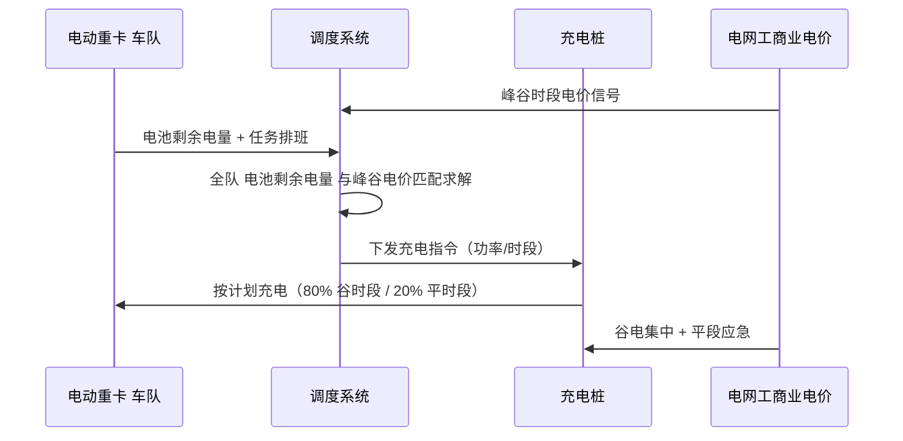
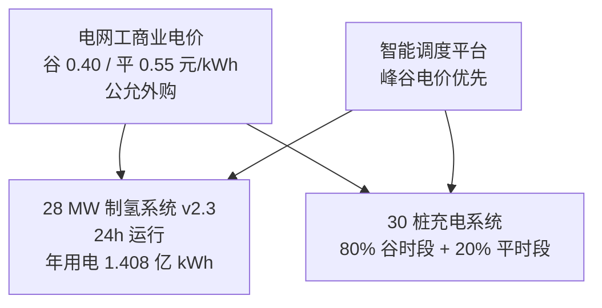

# 第 7 章 充电基础设施 v2.3

> 引用模型：[models/05_fleet_capex_opex.csv](../models/05_fleet_capex_opex.csv)
>
> v2.3 关键变化：① 删除"600 MW 光伏平段直供充电"叙事 —— 按 v2.3 电氢完全分离原则，1 GW 风光电站出项目边界，本项目充电电力一律按电网工商业电价（谷 0.40 / 平 0.55 元/kWh）公允外购；② 综合度电成本从 0.355 元/kWh 更新为 0.44 元/kWh（谷电为主 + 平段补充，无绿电直供折扣）；③ 充电调度仍保留谷时段集中充电策略以最小化总电费，但不再与风光出力耦合。

## 7.1 充电体系总体方案 v2.3

## 7.2 充电站布局

5 个集结点分布全矿区：

| 集结点编号 | 位置 | 充电桩数（480 kW） | 单点功率（MW） | 主要服务 |
|---|---|---:|---:|---|
| CS-01 | 矿区主入口 | 8 | 3.84 | 主线返程电池补能 |
| CS-02 | 短倒 A 区 | 8 | 3.84 | 短倒 电动重卡 主补能点 |
| CS-03 | 短倒 B 区 | 6 | 2.88 | 短倒 电动重卡 备用 |
| CS-04 | 维修车间 | 4 | 1.92 | 维保期补能 |
| CS-05 | 综合楼旁 | 4 | 1.92 | 调度池补能 |
| **合计** | | **30** | **14.40** | 100 台 电动重卡 |

## 7.3 充电桩规格

| 项 | 规格 |
|---|---|
| 单桩功率 | 480 kW（液冷超充） |
| 双枪并充能力 | 240 kW × 2 |
| 充电协议 | 国标 GB/T 27930 + ChaoJi 兼容 |
| 单台 电动重卡 充满（350 kWh）时间 | 约 50 分钟（80% 快充 + 慢充补足） |
| 谷电时段充满时间 | 60-90 分钟 |
| 充电桩寿命 | 8 年 |
| 单台 一次性总投资 | 80 万元（含线缆、安装） |

## 7.4 配电改造方案

### 7.4.1 新增主变与母线

| 设备 | 规格 | 数量 | 单价（万元） | 金额（万元） |
|---|---|---:|---:|---:|
| 110/10 kV 主变压器 | 31.5 MVA | 2 | 3,500 | 7,000 |
| 10 kV 配电延伸 | 含开关柜、线路 | 1 项 | 2,000 | 2,000 |
| 工程管理 (6%) | | | | 540 |
| **小计** | | | | **9,540** |

### 7.4.2 充电桩主投资

| 设备 | 数量 | 单价（万元） | 金额（万元） |
|---|---:|---:|---:|
| 480 kW 液冷超充 | 30 | 80 | 2,400 |
| 桩侧土建/雨棚 | 30 | 4 | 120 |
| 工程管理 (6%) | | | 24 |
| **小计** | | | **2,544** |

### 7.4.3 充电体系总 一次性总投资

> 12,084 万元（含变电+充电+土建+管理），与模型 05 板块 D 一致。

## 7.5 充电调度策略

### 7.5.1 时段划分 v2.3

| 时段 | 时长（h） | 电价（元/kWh）v2.3 | 主要电源 | 充电策略 |
|---|---:|---:|---|---|
| 谷时段（22:00-06:00） | 8 | 0.40 | 电网工商业谷电 | **集中充电 80% 电量** |
| 平时段（06:00-22:00，16h） | 16 | 0.55 | 电网工商业平电 | 补电 + 故障应急（20% 电量）|

> **v2.3 修订**：删除原峰时段（08:00-18:00）"0.20 元/kWh 光伏直供"口径 —— 按 v2.3 电氢完全分离原则，1 GW 风光电站出项目边界，本项目充电电力**一律按电网工商业电价公允外购**，不存在光伏直供折扣。

### 7.5.2 综合电价计算 v2.3

| 时段 | 电价（元/kWh）| 占比 | 加权电价 |
|---|---:|---:|---:|
| 谷时段 | 0.40 | 80% | 0.320 |
| 平时段 | 0.55 | 20% | 0.110 |
| **加权综合电价 v2.3** | | | **0.43 元/kWh** |

> **v2.3 说明**：综合电价从 v2.2 的 0.355 元/kWh 上升至 0.43 元/kWh，主要差异来自**删除"光伏直供 0.20 元/kWh"假设**（按 v2.3 强制电网公允外购）。模型 02 中统一按 0.43 元/kWh 口径核算，对应约 0.63 元/km 的电动重卡能源费。
>
> v2.3 未来 PPA 路径：业主可通过市场化风光长协 PPA（0.30 元/kWh）替代部分工商业电价外购，进一步压降综合电价；但此为市场化独立合同，不构成与 1 GW 风光电站的财务交叉。

### 7.5.3 调度智能化 v2.3

- 调度系统实时获取 100 台 电动重卡 的 电池剩余电量 与排班
- **v2.3 修订**：调度策略从"光伏直供优先"改为"峰谷电价优先"
- 谷时段集中充电（80% 电量），平段保留 20% 桩位用于应急与故障补电
- **v2.3 未来可选路径**：若业主启动风光长协 PPA（市场化独立合同），调度系统可加入 PPA 曲线作为补充电源信号

## 7.6 充电峰值分析

| 工况 | 同时充电车数 | 峰值功率 (MW) | 占总桩容量 |
|---|---:|---:|---:|
| 全队 100 台 电动重卡 全部充电（理论极端） | 100 | 14.40 | 100% |
| 实际峰值（25% 同时充电） | 25 | 12.00 | 83% |
| 谷时段集中充电 | 60 | 14.40（功率限） | 100% |
| 推荐运行峰值 | 30 | 14.40 | 100% |

> 配电主变 2×31.5 MVA = 63 MVA，远大于充电峰值 14.4 MW + 制氢 **28 MW v2.3** = 42.4 MW，**容量裕度 ~33%**。

## 7.7 与制氢系统的电网协同 v2.3

- **v2.3 修订**：彻底删除"风光直供"耦合逻辑 —— 按电氢完全分离原则，制氢与充电电力一律按电网公允价外购
- 制氢系统 24h 连续运行（以碱性电解槽为主，负荷波动 30%-100%，PEM 调峰）
- 充电系统夜间谷时段集中补能（80% 电量），平段补充（20%）
- 100 MWh 储能（预留）：用于矿区突发负荷平滑，不再用于"风光出力波动消纳"

## 7.8 换电模式预留

虽然推荐充电方案，但保留 30% 车辆配置换电接口：

| 项 | 充电模式（默认） | 换电模式（预留 30%） |
|---|---|---|
| 适用车型 | 60 台 电动重卡（矿区倒短） | 40 台 电动重卡（200 km 中途换电） |
| 单车整车价 | 45 万（v2.0 锚定） | 50 万（含换电接口） |
| 补能时间 | 30-60 分钟 | 5-8 分钟 |
| 配套设施 | 480 kW 超充 | 1 座矿区换电站 + 60 块备用电池 |
| 换电站投资 | — | 1,500 万元（已含模型 05 D 板块） |
| 是否本期建 | 是（30 桩） | **是**（v2.0 已纳入 D 充电基础设施总投，详见模型 05） |

## 7.9 充电运维

| 项 | 数值 | 说明 |
|---|---|---|
| 维保人员 | 8 人 | 含调度 + 设备维护 |
| 年维保成本 | 242 万元 | 一次性总投资 × 2% |
| 故障率 | 5% / 月 | 单桩 |
| 平均故障间隔（平均故障间隔） | 600 小时 | 国标 |
| 平均修复时间（平均修复时间） | 2 小时 | 自有维保 |

## 7.10 安全与标准合规

| 标准 | 适用 |
|---|---|
| GB/T 18487 | 电动汽车传导充电系统 |
| GB/T 27930 | 充电协议 |
| NB/T 33002 | 直流充电桩 |
| GB 50053 | 配电变电站设计 |
| 国标 IEC 61851 | 国际兼容 |

## 7.11 充电基础设施关键指标

| 指标 | 数值 v2.3 |
|---|---|
| 总桩数 | 30 桩（480 kW） |
| 总功率 | 14.40 MW |
| 单桩日充电量峰值 | 11,520 kWh |
| 100 台 电动重卡 日总用电 | 18,304 kWh（100 × 144 km × 145/100 × 0.875 利用率） |
| 单桩日实际充电量 | 700 kWh |
| 桩-车比 | 1 : 3.3 |
| 总 一次性总投资 | 12,084 万元 |
| 年 年运营成本 | 242 万元 |
| **综合度电成本 v2.3** | **0.43 元/kWh**（谷 80% + 平 20%，无绿电直供折扣）|

## 7.12 本章小结 v2.3

- 充电体系采用 **30 桩 × 480 kW 液冷超充 + 5 集结点分布式布局**
- 配电改造新增 2 × 31.5 MVA 110/10 kV 主变，容量裕度 ~33%（含 28 MW 制氢负荷 v2.3）
- **v2.3 修订**：删除"光伏直供"调度策略；智能调度系统改为"峰谷电价优先"，综合电价 0.43 元/kWh（较 v2.2 0.355 元上升 21%，根因为 v2.3 禁止使用光伏直供折扣）
- 30% 电动重卡 预留换电接口，为未来切换换电模式留出空间
- 总 一次性总投资 1.21 亿元，年 年运营成本 242 万元
- 与制氢系统共用配电网（v2.3 制氢 28 MW），整体电网友好性优于纯柴油基准
