# 第 9 章 投资估算与运营成本（一次性总投资 / 年运营成本）v2.3

> 引用模型：[models/05_fleet_capex_opex.csv](../models/05_fleet_capex_opex.csv)
>
> v2.3 关键变化（vs v2.2）：① **制氢系统装机按车队需求 110% 反推 30→28 MW**（24 Alk + 4 PEM），制氢 CAPEX 由 25,164 → **23,436 万元**（-1,728）；② **不规划任何对外氢气销售**，制氢年制量由 2,880→**2,816 t**，制氢电费 5,760→**5,632 万/年**；③ **氢相关综合险按 28 MW 资产值重算**：3,764 → **3,592 万/年**（-172）；④ 综合 OPEX 由 23,489 → **23,112 万/年**（-377）；⑤ 总 CAPEX 由 56,178 → **54,450 万元**（-1,728）。

## 9.1 总投资估算 v2.3

| 板块 | 金额（万元） | 占比 |
|---|---:|---:|
| A 车辆采购 | 10,500 | 19.3% |
| B 制氢系统（28 MW，v2.3 按需反推） | **23,436** | 43.0% |
| C 加氢站（3 座） | 6,480 | 11.9% |
| D 充电基础设施（含换电站） | 9,434 | 17.3% |
| E 土地与场地 | 2,300 | 4.2% |
| F 软投资（设计/监理/前期） | 2,300 | 4.2% |
| **合计 v2.3** | **54,450** | **100%** |

> 总投资 **5.45 亿元**（较 v2.2 5.62 亿元 -1,728 万元，全部来自制氢系统 30→28 MW 规模下调）。
> 制氢系统仍为第一大板块（43.0%），但较 v2.2 的 44.8% 下调。

## 9.2 板块明细

### 9.2.1 A 车辆采购（1.05 亿元）

| 子项 | 数量 | 单价（万元/台） | 金额（万元） |
|---|---:|---:|---:|
| 氢能重卡（49吨）（含国补到手） | 200 | 30 | 6,000 |
| 电动重卡（49吨）（含购置税减免到手） | 100 | 45 | 4,500 |
| **小计** | 300 | — | **10,500** |

> 单价说明（业主新口径）：
> - **氢能重卡 30 万/台**：参照 2025 年蜂巢/福田/陕汽对张家口示范应用集采含补贴价（裸车成交 90-110 万 - 国家燃料电池系统奖励 30-40 万 - 张家口示范配套 5-10 万 - 业主集采折扣 10-15 万）。
> - **电动重卡 45 万/台**：在车电分离/换电包月模式下，裸车 45 万元（电池模组以租赁/换电服务方式独立计费，月租 3,000-5,000 元/包）。

### 9.2.2 B 制氢系统（2.34 亿元，28 MW，v2.3 按需反推）

| 子项 | 金额（万元） |
|---|---:|
| 碱性电解槽 + 配套设备（24 MW × 432 万） | 10,368 |
| 质子交换膜电解槽 + 配套设备（4 MW × 900 万） | 3,600 |
| 原水/碱液/压缩机（3 台）/储氢/配电/土建/集散控制系统 | 7,732 |
| 工程管理与不可预见（8%） | 1,736 |
| **小计 v2.3** | **23,436** |

> **v2.3 关键说明**：制氢规模按 200 氢车 × 12.8 t/年 × 110% 冗余 = 2,816 t/年 反推，严格匹配车队需求，不规划对外氢气销售；设备国产化率 ≥ 75%；单 MW 一次性投资 837 万元（较 v2.2 的 839 万持平，因固定工程 8% 基数下调）。

### 9.2.3 C 加氢站（0.65 亿元）

| 子项 | 数量 | 单价（万元/座） | 金额（万元） |
|---|---:|---:|---:|
| 标准 1,000 kg/天 加氢站 | 3 | 2,000 | 6,000 |
| 工程管理（8%） | — | — | 480 |
| **小计** | 3 | — | **6,480** |

> 单座单价从 2,500 万降至 2,000 万：① 国产化压缩机/加注机 ② 与制氢站共用储氢/配电/消防设施。

### 9.2.4 D 充电基础设施（0.94 亿元）

| 子项 | 数量 | 单价（万元） | 金额（万元） |
|---|---:|---:|---:|
| 480 kW 液冷超充桩 | 30 | 80 | 2,400 |
| 矿区换电站（含 60 个备用电池模块） | 1 | 1,500 | 1,500 |
| 110/10 kV 主变压器（31.5 MVA） | 1 | 3,500 | 3,500 |
| 矿区 10 kV 配电网延伸 | 1 | 1,500 | 1,500 |
| 工程管理（6%） | — | — | 534 |
| **小计** | — | — | **9,434** |

> 新增 1 座换电站，专门服务 40 台中途电动重卡（200km 单程需 1 次换电）。

### 9.2.5 E 土地与场地（0.23 亿元）

| 子项 | 数量 | 单价 | 金额（万元） |
|---|---:|---:|---:|
| 1 万亩储备地内 200 亩平整与道路 | 1 项 | — | 1,500 |
| 围墙/消防/给排水/安防 | 1 项 | — | 800 |
| **小计** | — | — | **2,300** |

> 土地为业主既有，不计入土地出让金，仅计入平整与配套成本。

### 9.2.6 F 软投资（0.23 亿元）

| 子项 | 金额（万元） |
|---|---:|
| 可研/勘察/设计/监理（总投资 4.2%） | 1,800 |
| 项目前期与培训 | 500 |
| **小计** | **2,300** |

## 9.3 一次性总投资 资金来源建议 v2.3

| 资金来源 | 占比 | 金额（万元） | 备注 |
|---|---:|---:|---|
| 业主自有资金 | 35% | 19,058 | 含矿区现金流积累 |
| 绿色信贷（10 年期） | 50% | 27,225 | 贷款基础利率-1.5%（利率优惠） |
| 政策补贴（一次性） | 8% | 4,356 | 国补 + 加氢站建补 |
| 设备融资租赁 | 7% | 3,811 | 主要针对车辆与电解槽 |
| **合计** | 100% | **54,450** | — |

## 9.4 年运营成本（年运营成本，含氢相关综合险）v2.3

| 板块 | 金额（万元/年）v2.3 | 占比 |
|---|---:|---:|
| G1 氢能重卡运营成本（含氢相关综合险 + 制氢上网电价电费）| 17,836 | 77.2% |
| G2 电动重卡运营成本（已修正单位） | 3,826 | 16.6% |
| H 共用与管理 | 1,450 | 6.3% |
| **合计 v2.3** | **23,112** | **100%** |
| **其中：氢相关综合险（10%）** | **3,592** | **15.5%** |
| **其中：制氢电费（上网电价 0.40）** | **5,632** | **24.4%** |

> 年 年运营成本 **2.31 亿元**（较 v2.2 2.35 亿元 -377 万元，主因：28 MW 制氢电费 -128 + 氢险 -172 + 制氢 O&M -77）。
>
> v2.3 G1 占绝对主导（77.2%），G2 占比 16.6%（已修正 10× 单位错误后稳定口径）。

## 9.5 氢相关综合险归集说明（用户口径 v2.3）

按业主要求，**所有氢相关投资的综合保险（按资产值 10% 年费率）全部归集为氢能重卡运营成本**，v2.3 更新结构：

| 保险归集项 | 资产值（万元） | 费率 | 年保险金额（万元/年） |
|---|---:|---:|---:|
| 氢能重卡 资产值 | 6,000 | 10% | 600 |
| **制氢系统 资产值（28 MW）** | **23,436** | 10% | **2,344** |
| 加氢站 资产值 | 6,480 | 10% | 648 |
| **合计 v2.3** | **35,916** | **10%** | **3,592** |

> **说明**：
> - 氢相关综合险按用户口径取年费率 10%（市场常规行业财产险率 0.5-3%，10% 反映氢能高安全等级 + 示范期高试点风险）。
> - 此 3,592 万/年的氢相关综合险全额计入"氢能重卡运营成本"科目，不在制氢系统/加氢站子项重复列计。
> - v2.3 相比 v2.2 下降 172 万/年，主因制氢系统资产值由 25,164 → 23,436 万元（-1,728）。
> - 推荐方案进一步建议通过：① 集团采购统保 ② 中再保险分摊 ③ 政策性氢能保险池试点，将费率压降至 3%（即 1,077 万/年），节省 2,515 万/年（详见第 11 章敏感性）。

## 9.6 年运营成本 板块明细

### 9.6.1 G1 氢能重卡运营成本 v2.3（1.78 亿元/年）

| 子项 | 计算式 | 金额（万元/年）v2.3 |
|---|---|---:|
| **制氢电费（上网电价 0.40 元/kWh）** | 2,816 t/年 × 50 kWh/kg × 0.40 元/kWh | **5,632** |
| 制氢系统 O&M（一次性总投资 × 3%） | 23,436 × 3% | 703 |
| 制氢人员/原水/碱液/管理 | — | 762 |
| 加氢站 O&M（一次性总投资 × 3%） | 6,480 × 3% | 194 |
| 加氢站人员/管理 | — | 400 |
| **氢相关综合险（10% 资产值，用户口径）** | 35,916 × 10% | **3,592** |
| 车辆维保（200 台 × 6 万） | — | 1,200 |
| 车辆司机（200 台 × 2 班 × 12 万） | — | 4,800 |
| 车辆常规险/燃料附属 | 200 × 1.5 万 | 300 |
| 电堆中修摊销（10 年 1 次 × 12 万） | 200 × 1.2 万 | 240 |
| **小计 v2.3** | | **17,836** |

### 9.6.2 G2 电动重卡运营成本 v2.3（0.38 亿元/年）

| 子项 | 计算式 | 金额（万元/年）v2.3 |
|---|---|---:|
| **中途充电/换电服务费** | 40 台 × 11.264 万/台 | **451** |
| **矿区充电费** | 60 台 × 2.851 万/台 | **171** |
| 车辆维保 | 40 × 4 + 60 × 3 | 340 |
| 车辆司机 | 40 × 2 班 × 12 + 60 × 2 班 × 10 | 2,160 |
| 车辆常规险 | 100 × 1.0 万 | 100 |
| 电池中修摊销 | 40 × 1.5 + 60 × 1.2 | 132 |
| 充电/换电设施 O&M | 9,434 × 5% | 472 |
| **小计 v2.3** | | **3,826** |

> **G2 单位修正说明（v2.2 起永久修正）**：v2.0/2.1 中"中途充换电 4,506 万 / 矿区充电 1,711 万"按 40/60 台规模计存在 10× 单位错误（单位应为 元 而非 万元，金额应为 451/171 万元）。模型 02 单车口径 11.264 / 2.851 万元/台/年 与本表已对齐。

### 9.6.3 H 共用与管理（0.15 亿元/年）

| 子项 | 金额（万元/年） |
|---|---:|
| 土地租金/物业 | 150 |
| 总部管理（财务/HR/IT） | 800 |
| 数字化系统 O&M（车队调度+能源管理+综合智能平台） | 300 |
| 安全/应急/检测 | 200 |
| **小计** | **1,450** |

## 9.7 与柴油基准方案对比 v2.3

| 项目 | 新方案 v2.3（300 台） | 柴油基准（300 台） | 差额 |
|---|---:|---:|---:|
| 车辆 一次性总投资 | 10,500 | 15,000 | -4,500 |
| 配套设施 一次性总投资 | 43,950 | 500 | +43,450 |
| **总 一次性总投资** | **54,450** | **15,500** | **+38,950** |
| 年能源（v2.3 制氢电费 5,632 + G2 电费 622）| 6,254 | 38,400 | -32,146 |
| 年维保+中修 | 1,639 | 2,400 | -761 |
| 年人员 | 7,760 | 4,500 | +3,260 |
| 年保险（含氢相关综合险） | 3,692 | 450 | +3,242 |
| 年管理+其他 | 1,844 | 1,800 | +44 |
| **年 年运营成本 v2.3** | **23,112** | **47,550** | **-24,438** |

> **关键洞察 v2.3**：
> - 增量 一次性总投资 **3.90 亿元**（vs v2.2 4.07 亿，-1,728 万）
> - 年运营节约 **2.44 亿元**（vs v2.2 2.41 亿，+377 万）
> - 简单回收期：3.90 ÷ 2.44 = **1.60 年**（不含示范期补贴和副产氧气/碳收益）
> - 推荐+PPA 情景动态投资回收期 **7.0 年**（含 10% 氢相关综合险压力，详见第 10 章 v2.3）

## 9.8 单位运输成本（单位运输成本）v2.3

| 项 | 计算 | 数值 v2.3 |
|---|---|---:|
| 全队年里程 | 3,214 万 km | |
| 年运量（中途+矿区） | 1,516 万吨 | |
| 全队货运周转量 | 5.88 亿吨·km | |
| 年总成本（含 一次性总投资 折旧）v2.3 | 23,112 + 5,445 = 28,557 万元 | |
| **单位运输成本 含折旧（成本口径）** | 28,557 ÷ 58,750 万 | **0.49 元/吨·km** |
| 单位运输成本 仅运营（成本口径） | 23,112 ÷ 58,750 万 | 0.39 元/吨·km |
| 柴油基准 单位运输成本 含折旧 | (47,550 + 1,500) ÷ 58,750 万 | 0.83 元/吨·km |
| **节约（成本口径 v2.3）** | — | **0.34 元/吨·km（41%）** |

> 注：模型 06 v2.3 给出的 单位运输成本 0.39 元/吨·km 为"推荐情景下项目净成本口径"——即扣除副产氧气/碳/补贴等非运输收入后的净 年运营成本 摊销，反映项目方实际承担成本。
> - **成本口径 0.49 元/吨·km v2.3**：用于与柴油运输成本对标
> - **净成本口径 0.39 元/吨·km v2.3 推荐情景**：用于评估项目对业主的内部计价空间

## 9.9 现金流时点（建设期）

```mermaid
gantt
    title 一次性总投资 投放时点 (第0年 = 2026)
    dateFormat MM
    axisFormat M%m
    section 车辆采购
    试点 30 氢能+15 电动 (1350万)   :2026-04, 2M
    放量首批 100 氢能+50 电动 (5250万) :2026-09, 4M
    放量二批 70 氢能+35 电动 (3675万)  :2027-02, 4M
    section 制氢系统 28 MW
    电解槽采购 (13968万)            :2026-04, 6M
    安装调试 (9468万)               :2026-08, 8M
    section 加氢站
    加氢站-01 建设 (2160万)         :2026-04, 5M
    加氢站-02 建设 (2160万)         :2026-09, 5M
    加氢站-03 建设 (2160万)         :2027-02, 5M
    section 充电与换电
    主变扩容 (3500万)               :2026-04, 6M
    充电桩部署 (2400万)             :2026-09, 6M
    换电站建设 (1500万)             :2026-08, 5M
    配网延伸 (1500万)               :2026-04, 8M
    section 土地与软投资
    场地与软投 (4600万)             :2026-01, 24M
```

## 9.10 本章小结 v2.3

- 总 一次性总投资 **5.45 亿元**（vs v2.2 5.62 亿，-1,728 万，全部来自 30→28 MW 制氢规模按需反推）
- 年 年运营成本 **2.31 亿元 v2.3**（含氢相关综合险 3,592 万/年 + 制氢上网电价电费 5,632 万/年）
- 板块占比：制氢 43.0%（最大）、车辆 19.3%、充电 17.3%、加氢 11.9%、其他 8.4%
- **氢相关综合险按用户口径取 10% 资产值，全额归入氢能重卡运营成本，年保费 3,592 万元**（占年运营成本 15.5%）
- **制氢电费按上网电价 0.40 元/kWh 公允采购，年电费 5,632 万元**（占年运营成本 24.4%）
- 相对柴油基准：增量 一次性总投资 3.90 亿，年运营节约 2.44 亿，简单回收期 1.60 年
- 资金来源以"业主自筹 35% + 绿色信贷 50% + 政策补贴 8% + 融资租赁 7%"为推荐结构
- 单位运输成本 0.49 元/吨·km（含折旧），优于柴油基准 0.83 元/吨·km 约 41%
- **v2.3 核心变化**：制氢按需反推（不规划外售）+ 电氢完全分离（电站出边界）+ 商业 ROI 优先
