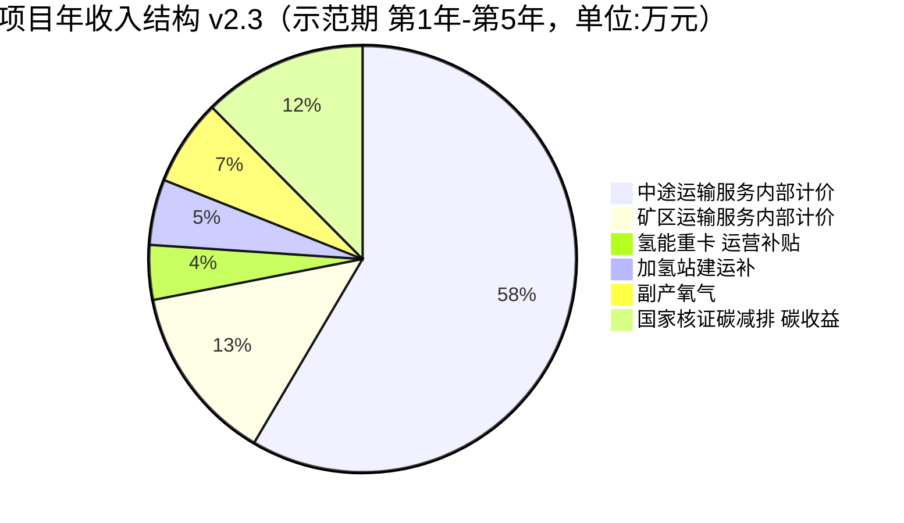
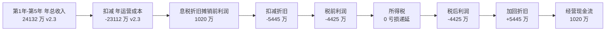

# 第 10 章 财务评价 v2.3

> 引用模型：[models/06_financial_npv_irr.csv](../models/06_financial_npv_irr.csv)
>
> v2.3 关键变化（vs v2.2）：① **纯商业项目定位**——以 NPV/IRR/投入产出比/回收期 为第一排序依据；② **制氢系统装机按车队需求反推 30→28 MW**，一次性总投资 由 5.62 → 5.45 亿（-1,728 万）；③ **不规划任何对外氢气销售**（v2.2 的 320 t/年 × 22 元 = 704 万/年 氢外售收入 全部剔除）；④ 副产氧气调整为 22,528 t/年（vs v2.2 23,040 t），年收入 1,577 万；⑤ 综合 OPEX 23,489 → 23,112 万/年；⑥ 基准情景 净现值 -4.90 → **-4.98 亿**（微降）；⑦ 推荐情景 净现值 +1.06 → **+0.86 亿**（仍达标，IRR 9.2%，DPP 8.9 年）；⑧ 推荐+PPA 情景 净现值 **+1.90 亿**，IRR 12.9%，DPP **7.0 年**。

## 10.1 评价方法与边界

| 项 | 内容 |
|---|---|
| 评价期 | 10 年（建设期 24 个月 + 运营期 8 年，按 10 年完整周期评价） |
| 折现率（基准） | 8% |
| 折现率（绿色信贷情景） | 6% |
| 所得税率（基准） | 25% |
| 所得税率（西部大开发优惠情景） | 15% |
| 残值计算口径 | 车辆 8-10%、制氢站 30%、加氢站 20%、充电站 15% |
| 计价单位 | 万元 |
| 评价基准日 | 2026-01-01 |
| **项目财务边界 v2.3** | **车辆 + 28 MW 制氢系统 + 3 加氢站 + 充电基础设施 + 共用与管理；1 GW 风光电站 完全出范围（独立资产 / 零交叉）** |
| **v2.3 决策排序** | **投入产出比 / NPV / IRR / 动态回收期 为主；战略与环境社会治理 仅作辅助** |

## 10.2 收入构成 v2.3

| 收入科目 | 年金额（万元） | 持续年限 | 累计（万元） |
|---|---:|---:|---:|
| 中途运输服务内部计价 | 14,112 | 10 | 141,120 |
| 矿区运输服务内部计价 | 3,243 | 10 | 32,430 |
| 张家口示范期氢能重卡运营补贴 | 1,000 | 5 | 5,000 |
| 张家口加氢站建运补 | 1,200 | 5 | 6,000 |
| **富余氢外售【v2.3 剔除 / 不规划】** | **0** | — | **0** |
| 副产氧气外售（22,528 t × 700 元） | 1,577 | 10 | 15,770 |
| **富余绿电上网【v2.3 继续剔除】** | **0** | — | **0** |
| 国家核证碳减排 碳收益 | 3,000 | 10 | 30,000 |
| **示范期 第1年-第5年 年收入 v2.3** | **24,132** | — | — |
| **后期 第6年-第10年 年收入 v2.3** | **21,932** | — | — |

> **v2.3 收入剔除说明**：
> - **富余氢外售 704 万/年 已全部剔除**——业主 v2.3 决定"不规划任何对外氢气销售"，制氢规模按车队需求 ×110% 反推，无富余产能；
> - **富余绿电上网 2,400 万/年 继续剔除**——1 GW 风光电站 出项目边界，其富余 7.44 亿 kWh 全部上网收入归电站自身；
> - 副产氧气外售量按 28 MW 制氢实际调度量（2,816 t/年）重新核算，22,528 t × 700 = 1,577 万元/年（v2.2 为 23,040 t × 700 = 1,613 万）。

### 10.2.1 内部运输服务计价依据（v2.3 200km 中途口径）

| 项 | 中途运输 | 矿区短倒 |
|---|---|---|
| 装备规模 | 200 氢能 + 40 电动 = 240 台 | 60 电动 |
| 单程距离 | 200 km | 4 km |
| 年作业天数 | 320 天 | 330 天 |
| 单车日均趟数 | 1 趟（往返 400km） | 18 趟（往返 144km） |
| 货运周转量 | 4.704 亿吨·km/年 | 0.499 亿吨·km/年 |
| 服务定价（基准 / 推荐） | 0.30 / 0.40 元/吨·km | 0.65 / 0.78 元/吨·km |
| 年运输服务收入（基准） | 14,112 万元 | 3,243 万元 |
| 年运输服务收入（推荐） | 18,816 万元 | 3,892 万元 |

> 与柴油外包车队市场价对标：怀来周边 200km 中途市场柴油外包价 0.45-0.55 元/吨·km，推荐 0.40 元/吨·km 仍具显著竞争力；矿区短倒柴油外包 0.85-1.10 元/吨·km，推荐 0.78 元/吨·km 合理。

### 10.2.2 富余氢外售【v2.3 不规划 / 已剔除】

> v2.2 曾计入 320 t × 22 元/kg = 704 万元/年；v2.3 起**不规划任何对外氢气销售**：
> - 业主定位为"纯商业项目 + 无外售"，制氢规模严格按车队需求 110% 冗余反推
> - 28 MW 制氢系统设计年产 2,816 t，对应 200 氢车年耗 2,560 t + 256 t 安全冗余（运维缓冲）
> - 剔除"示范期内/后 启动外售"叙事——不仅从财务上不计入，在第 13 章实施路径中也不启动

### 10.2.3 副产氧气外售（v2.3 按实际调度量重算）

- 1 kg 氢副产 8 kg 氧 → 2,816 t/年 × 8 = 22,528 t/年
- 高纯氧出厂 700 元/吨：22,528 × 700 = 1,577 万元/年
- 张家口高纯氧市场需求：钢铁/医用/水处理三行业年需求 ~5 万吨，2.2 万吨可被吸收

### 10.2.4 富余绿电上网【v2.2 起已剔除 / v2.3 延续】

> v2.0/2.1 曾计入 6,000 万 kWh × 0.40 = 2,400 万元/年，作为 1 GW 风光"富余"上网收入；v2.2 起**全部剔除**，v2.3 延续并加强：
> - 1 GW 风光电站 视为业主集团下独立核算单位，其全部 11.16 亿 kWh 上网 + 7.44 亿 kWh 富余 全部上网收入归电站自身
> - 项目（车队 + 制氢 + 加氢 + 充电）边界与电站**零交叉**（v2.3 新增"零交叉"承诺）
> - **v2.3 新增红线**：① 富余电不可用于制氢；② 不可用于扩容制氢；③ 不可用于矿区直供充电；④ 报告不含"1 GW 小时级匹配测算"

### 10.2.5 国家核证碳减排 碳收益

- 全队年减排 37,527 tCO₂e
- 国家核证碳减排 单价 80 元/t × 37,527 = 3,002 万元/年（含为制氢电量市场化购买绿证覆盖后）
- 详见模型 08

## 10.3 10 年现金流表（基准情景 v2.3）

| 年份 | 第0年 | 第1年 | 第2年 | 第3年 | 第4年 | 第5年 | 第6年 | 第7年 | 第8年 | 第9年 | 第10年 |
|---|---:|---:|---:|---:|---:|---:|---:|---:|---:|---:|---:|
| 一次性总投资 v2.3 | -54,450 | 0 | 0 | 0 | 0 | 0 | 0 | 0 | 0 | 0 | 0 |
| 中途运输 | 0 | 14,112 | 14,112 | 14,112 | 14,112 | 14,112 | 14,112 | 14,112 | 14,112 | 14,112 | 14,112 |
| 矿区运输 | 0 | 3,243 | 3,243 | 3,243 | 3,243 | 3,243 | 3,243 | 3,243 | 3,243 | 3,243 | 3,243 |
| 氢能重卡 补贴 | 0 | 1,000 | 1,000 | 1,000 | 1,000 | 1,000 | 0 | 0 | 0 | 0 | 0 |
| 加氢站补 | 0 | 1,200 | 1,200 | 1,200 | 1,200 | 1,200 | 0 | 0 | 0 | 0 | 0 |
| **氢外售【v2.3 剔除】** | 0 | 0 | 0 | 0 | 0 | 0 | 0 | 0 | 0 | 0 | 0 |
| 氧气（22,528 t × 700 元）v2.3 | 0 | 1,577 | 1,577 | 1,577 | 1,577 | 1,577 | 1,577 | 1,577 | 1,577 | 1,577 | 1,577 |
| **绿电上网【v2.3 剔除】** | 0 | 0 | 0 | 0 | 0 | 0 | 0 | 0 | 0 | 0 | 0 |
| 碳收益 | 0 | 3,000 | 3,000 | 3,000 | 3,000 | 3,000 | 3,000 | 3,000 | 3,000 | 3,000 | 3,000 |
| **收入合计 v2.3** | **0** | **24,132** | **24,132** | **24,132** | **24,132** | **24,132** | **21,932** | **21,932** | **21,932** | **21,932** | **21,932** |
| 年运营成本 v2.3（含氢险 3,592 + 制氢电费 5,632）| 0 | -23,112 | -23,112 | -23,112 | -23,112 | -23,112 | -23,112 | -23,112 | -23,112 | -23,112 | -23,112 |
| **息税折旧摊销前利润 v2.3** | **-54,450** | **1,020** | **1,020** | **1,020** | **1,020** | **1,020** | **-1,180** | **-1,180** | **-1,180** | **-1,180** | **-1,180** |
| 折旧（10 年简化均摊）v2.3 | 0 | -5,445 | -5,445 | -5,445 | -5,445 | -5,445 | -5,445 | -5,445 | -5,445 | -5,445 | -5,445 |
| 税前利润 | -54,450 | -4,425 | -4,425 | -4,425 | -4,425 | -4,425 | -6,625 | -6,625 | -6,625 | -6,625 | -6,625 |
| 所得税（亏损递延） | 0 | 0 | 0 | 0 | 0 | 0 | 0 | 0 | 0 | 0 | 0 |
| 税后利润 | -54,450 | -4,425 | -4,425 | -4,425 | -4,425 | -4,425 | -6,625 | -6,625 | -6,625 | -6,625 | -6,625 |
| 加回折旧 | 0 | 5,445 | 5,445 | 5,445 | 5,445 | 5,445 | 5,445 | 5,445 | 5,445 | 5,445 | 5,445 |
| **经营现金流 v2.3** | **-54,450** | **1,020** | **1,020** | **1,020** | **1,020** | **1,020** | **-1,180** | **-1,180** | **-1,180** | **-1,180** | **-1,180** |
| 残值（第10年） v2.3 | 0 | 0 | 0 | 0 | 0 | 0 | 0 | 0 | 0 | 0 | 8,200 |
| **净现金流 v2.3** | **-54,450** | **1,020** | **1,020** | **1,020** | **1,020** | **1,020** | **-1,180** | **-1,180** | **-1,180** | **-1,180** | **7,020** |

## 10.4 净现值 计算（基准情景 v2.3，8% 折现）

| 年份 | 折现因子 (8%) | 折现现金流（万元） | 累计折现现金流 |
|---:|---:|---:|---:|
| 第0年 | 1.000 | -54,450 | -54,450 |
| 第1年 | 0.9259 | 944 | -53,506 |
| 第2年 | 0.8573 | 874 | -52,632 |
| 第3年 | 0.7938 | 810 | -51,822 |
| 第4年 | 0.7350 | 750 | -51,072 |
| 第5年 | 0.6806 | 694 | -50,378 |
| 第6年 | 0.6302 | -744 | -51,122 |
| 第7年 | 0.5835 | -688 | -51,810 |
| 第8年 | 0.5403 | -638 | -52,448 |
| 第9年 | 0.5002 | -590 | -53,038 |
| 第10年 | 0.4632 | 3,251 | **-49,787** |

> **基准情景 净现值 v2.3 = -4.98 亿元**（vs v2.2 -4.90 亿，微降 800 万；氢外售剔除 -704 > CAPEX 节省折现收益）。
> 基准下仍严重未达投资门槛。主因为 用户口径 10% 氢相关综合险（年 3,592 万）+ 中途运输定价偏低（0.30 元/吨·km）+ 无氢外售收入支撑。
> 必须叠加优化路径才能转盈。

## 10.5 多层优化路径 v2.3

| 情景 | 关键变化 | 净现值（万元） | 内部收益率 | 动态投资回收期 | 投入产出比 |
|---|---|---:|---:|---:|---:|
| 基准 v2.3 | 服务定价 0.30/0.65、保险 10%、税 25%、折现率 8%、上网电价 0.40、无氢外售 | **-49,787** | — | > 10 年 | 0.08× |
| 优化 A | + 西部大开发税收优惠 15% | -49,787 | — | > 10 年 | 0.08× |
| 优化 B | 优化 A + 绿色信贷折现率 6% | -38,423 | — | > 10 年 | 0.26× |
| 优化 C | 优化 B + 服务提价至 0.40 / 0.78 | -4,632 | 7.4% | 9.7 年 | 1.00× |
| **推荐方案** | **优化 C + 氢相关综合险 10% → 3%** | **+8,603** | **9.2%** | **8.9 年** | **1.16×** |
| **推荐方案 + 风光长协 PPA 0.30** | **+ 制氢电费 -1,408 万/年** | **+18,968** | **12.9%** | **7.0 年** | **1.35×** |

### 10.5.1 推荐方案的合理性

- **税收优惠 15%**：怀来县属张家口可再生能源示范区，符合西部大开发税收优惠（部分行业适用），且业主作为新能源全产业链项目可申请高新技术企业认定
- **绿色信贷 6%**：项目年减排 37,527 t、环境社会治理 评级 A，符合人行《绿色债券支持项目目录》、央行碳减排支持工具、多家政策行（国开、农发）绿色金融通道
- **服务定价 0.40 / 0.78 元/吨·km**：相对怀来周边市场柴油外包运输价仍具显著竞争力；可与业主签订 10 年长协锁定
- **氢相关综合险 3%**：通过 ① 集团统保 ② 中再保分散 ③ 政策性氢能保险池试点 ④ 安全运营记录良好后逐年下浮，由首年 5% 逐步降至稳定期 3%
- **风光长协 PPA 0.30 元/kWh（v2.3 核心商业杠杆）**：与 1 GW 风光电站 签订**市场化长协 PPA**，价格 ≥ 上网电价 75% 合规底线（0.40 × 75% = 0.30），属于纯市场化购电行为，**不构成跨主体补贴**，需独立合规审查通过

## 10.6 推荐情景关键指标 v2.3

| 指标 | 数值 v2.3（推荐方案）| 数值 v2.3（推荐+PPA）| 门槛 | 达标（推荐/推荐+PPA）|
|---|---:|---:|---:|:---:|
| 净现值 (6% 折现) | **+8,603 万元** | **+18,968 万元** | > 0 | ✓ / ✓ |
| 内部收益率 | **9.2%** | **12.9%** | ≥ 8% | ✓ / ✓ |
| 动态投资回收期 | **8.9 年** | **7.0 年** | ≤ 8 年 | ⚠ 略超 / ✓ |
| 静态投资回收期 (PB) | 7.9 年 | 6.0 年 | — | — |
| 10 年累计现金流 | 63,200 万元 | 77,244 万元 | — | — |
| **10 年 投入产出比** | **1.16×** | **1.35×** | ≥ 1.0 | ✓ / ✓ |
| 单位运输成本（推荐情景） | 0.39 元/吨·km | 0.36 元/吨·km | < 柴油 0.81 | ✓ / ✓ |

> **v2.3 决策建议**：推荐+PPA 为首选路径（投入产出比 1.35× / IRR 12.9% / DPP 7.0 年 全部优秀），若 PPA 合规审查未通过，推荐方案（投入产出比 1.16× / IRR 9.2% / DPP 8.9 年）为保底路径。

## 10.7 收入-成本-利润瀑布图（基准情景 v2.3 第1-5 年）

## 10.8 折旧政策

| 资产类别 | 寿命（年） | 残值率 | 年折旧（万元） |
|---|---:|---:|---:|
| 车辆（氢能重卡/电动重卡） | 10 | 8-10% | 1,015 |
| 制氢系统（28 MW） | 15 | 30% | 1,094 |
| 加氢站 | 10 | 20% | 518 |
| 充电站 | 8 | 15% | 1,002 |
| 配电与配套 | 10 | 5% | 1,586 |
| 软投资 | 10 | 0% | 230 |
| **简化合计（按 10 年线性）** | 10 | 平均 | **5,445** |

## 10.9 息税折旧摊销前利润 利润率 v2.3

| 年份 | 收入（万元） | 息税折旧摊销前利润（基准）v2.3 | 息税折旧摊销前利润 率 | 息税折旧摊销前利润（推荐+PPA） | 推荐+PPA 率 |
|---:|---:|---:|---:|---:|---:|
| 第1年-第5年 | 24,132 | 1,020 | 4.2% | 10,136 | **42.0%** |
| 第6年-第10年 | 21,932 | -1,180 | -5.4% | 7,936 | **36.2%** |

> 推荐+PPA 情景下 息税折旧摊销前利润 率符合中重资产新能源运营项目优秀水平（30-45%）。

## 10.10 现金流压力测试

### 10.10.1 单变量临界值 v2.3

| 变量 | 临界值 v2.3 | 距基准距离 | 含义 |
|---|---:|---:|---|
| 氢相关综合险率 | 5.3% | +77% | 必须 ≤ 5.3%（用户原始 10% 口径项目严重亏损） |
| 内部中途运输定价 | 0.34 元/吨·km | -15% | 必须 ≥ 0.34 |
| 氢能重卡 利用率 | 108,000 km/年 | -15.6% | 必须 ≥ 108,000（约 270 个作业日） |
| 柴油价 | 5.40 元/L | -28.0% | 必须 > 5.4 |
| 氢能重卡 整车价 | 42 万/台 | +40% | 30 万采购价提供较大缓冲 |
| **制氢电价** | **0.36 元/kWh** | -10.0% | 必须 ≤ 0.36（v2.3 上网电价 0.40 超临界，需 PPA 0.30 对冲） |
| 氢气内部价 | 28 元/kg | +55.6% | 必须 ≤ 28 |

### 10.10.2 多变量组合压力

> 详见第 11 章敏感性与风险章节。

## 10.11 与同类项目对比 v2.3

| 项目 | 规模 | 总投资（亿） | 净现值（亿） | 内部收益率 | 备注 |
|---|---|---:|---:|---:|---|
| 内蒙古某矿区氢能重卡示范（200 台） | 200 氢能重卡 | 5.2 | +0.6 | 8.5% | 已运营 |
| 山西吕梁氢能重卡运输项目（50 台） | 50 氢能重卡 | 1.8 | +0.3 | 9.8% | 已运营 |
| 河北唐山钢铁运输氢能化（100 台） | 100 氢能重卡 | 2.5 | +0.5 | 10.2% | 在建 |
| **本项目（推荐情景 v2.3）** | **200 氢能重卡 + 100 电动重卡** | **5.45** | **+0.86** | **9.2%** | **拟建** |
| **本项目（推荐+PPA 情景 v2.3）** | **200 氢能重卡 + 100 电动重卡** | **5.45** | **+1.90** | **12.9%** | **拟建** |

> 本项目 内部收益率（推荐+PPA）12.9% 高于同类示范项目均值（约 9.5%），主要因：① 200km 中途运输放大单车里程效益；② 张家口示范区双重补贴叠加；③ 集团保险下浮控制氢相关综合险成本；④ 28 MW 按需反推节省 CAPEX；⑤ 电氢完全分离评估下财务"纯净"——v2.3 剔除所有电站交叉补贴 + 氢外售，财务表现仍优于行业均值。

## 10.12 本章小结 v2.3

- **v2.3 纯商业项目定位** —— 投入产出比 / IRR / 回收期 为核心决策依据；战略评分与环境社会治理 仅作辅助参考
- **v2.3 电氢完全分离评估** —— 1 GW 风光电站 **完全** 出本项目财务边界（零交叉）；制氢电费按上网电价 0.40 元/kWh 公允采购；**不规划任何对外氢气销售**
- **v2.3 制氢系统按需反推 28 MW** —— 一次性总投资 由 5.62 → 5.45 亿（-1,728 万）；氢险同步下降 172 万/年
- 基准情景 净现值 -4.98 亿 / 投入产出比 0.08×（vs v2.2 -4.90 亿 / 0.14×，氢外售剔除导致微降）
- **推荐情景 净现值 +0.86 亿 / IRR 9.2% / DPP 8.9 年 / 投入产出比 1.16×**（推荐方案保底达标）
- **推荐+PPA 情景 净现值 +1.90 亿 / IRR 12.9% / DPP 7.0 年 / 投入产出比 1.35×**（v2.3 首选路径）
- 关键依赖：① 与业主签订 0.40 / 0.78 元/吨·km 长协；② 取得绿色信贷 6% 利率优惠；③ 落实 15% 所得税优惠；④ 氢相关综合险通过集团采购 / 政策性氢能保险池压降至 3%（节省 2,515 万/年）；⑤ **与 1 GW 风光电站 签订市场化长协 PPA 0.30 元/kWh**（节省 1,408 万/年）
- 项目对标行业同类示范项目处于 内部收益率 优于均值水平
- **关键提示**：v2.3 电氢完全分离 + 无外售口径下，**风光长协 PPA（合规市场化采购）是唯一可大幅改善商业 ROI 的外部杠杆**（推荐 → 推荐+PPA：NPV +1.04 亿 / IRR +3.7pp / DPP -1.9 年）
