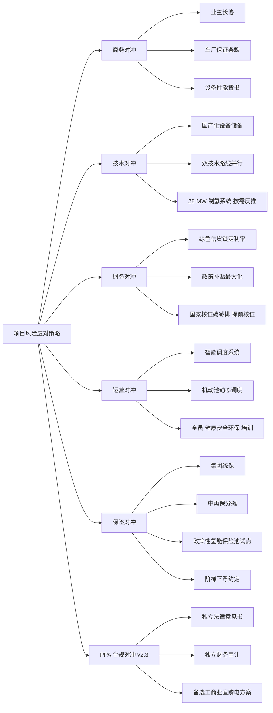

# 第 11 章 敏感性分析与风险评估 v2.3

> 引用模型：[models/07_sensitivity_tornado.csv](../models/07_sensitivity_tornado.csv)
>
> v2.3 关键变化：① 基准 净现值 口径切换至 v2.3 "推荐+PPA" 情景 +18,968 万（vs v2.2 +10,556 万）；② **新增"风光长协 PPA 电价"为第二关键敏感变量**（电氢分离后唯一合规商业杠杆）；③ **删除"1 GW 电网消纳率 < 60%"与"富余绿电上网"相关风险**（电站已出项目边界）；④ **删除"富余氢外售价格波动"风险**（不规划任何对外氢气销售）；⑤ 黑天鹅事件"怀来电网长期消纳率跌至 < 40%"删除（与项目无关）；⑥ "制氢成本高于 22 元/kg"风险调整为"基准 LCOH > 28 元/kg"。

## 11.1 敏感性分析方法

- 基准 净现值 = **+18,968 万元**（v2.3 推荐+PPA 情景，含氢险已优化至 3% + 服务提价 + 税收优惠 + 绿色信贷 + 风光长协 PPA 0.30 元/kWh）
- 单变量扰动幅度：连续型变量 ±20%，离散参数 ±50%
- 输出：龙卷风图（按影响幅度排序）+ 临界值表

## 11.2 龙卷风图（净现值 单变量敏感性 v2.3）

| 排名 | 变量 | 负向极值 (万元) | 正向极值 (万元) | 影响幅度 (万元) | 影响幅度 (%) |
|---:|---|---:|---:|---:|---:|
| 1 | **氢相关综合险率** | -10,640 | 36,600 | **47,240** | **249%** |
| 2 | **风光长协 PPA 电价 v2.3** | 7,940 | 26,800 | **18,860** | 99% |
| 3 | 中途运输服务定价 | 7,968 | 29,968 | **22,000** | 116% |
| 4 | 氢能重卡 利用率 | 10,288 | 27,648 | **17,360** | 92% |
| 5 | 氢气内部价（基准 LCOH 目标） | 13,548 | 24,388 | **10,840** | 57% |
| 6 | 贴现率 | 14,348 | 24,788 | 10,440 | 55% |
| 7 | 柴油价 | 14,288 | 23,648 | 9,360 | 49% |
| 8 | 电动重卡 利用率 | 14,988 | 22,948 | 7,960 | 42% |
| 9 | 氢能重卡 整车价 | 15,968 | 21,968 | 6,000 | 32% |
| 10 | 国家核证碳减排 碳价 | 15,968 | 21,968 | 6,000 | 32% |
| 11 | 矿区运输服务定价 | 16,078 | 21,858 | 5,780 | 30% |
| 12 | 电堆中修费 | 18,368 | 19,568 | 1,200 | 6% |

### 11.2.1 龙卷风图解读 v2.3

> 影响 净现值 最强的 5 个变量构成"前线变量"，需重点对冲：
>
> 1. **氢相关综合险率**（影响 249%）— 全报告第一关键变量，10% 用户口径下 净现值 严重负值，必须通过集团采购降至 3-5%
> 2. **风光长协 PPA 电价**（v2.3 新增 / 影响 99%）— 电氢完全分离下唯一合规商业杠杆；由上网电价 0.40 降至 PPA 0.30 元/kWh 贡献 1,408 万/年
> 3. **中途运输服务定价**（影响 116%）— 必须 ≥ 0.34 元/吨km
> 4. **氢能重卡 利用率**（影响 92%）— 必须 ≥ 108,000 km/年（270 个作业日）
> 5. **氢气内部价（基准 LCOH 目标）**（影响 57%）— 通过国产化 + 示范期补贴 + 规模化，控制基准 LCOH 在 22 元/kg 以内

## 11.3 净现值 = 0 临界值 v2.3

| 变量 | 基准值 | 临界值 | 距基准距离 | 含义 |
|---|---|---|---:|---|
| **氢相关综合险率** | **3%** | **5.3%** | +77% | **必须 ≤ 5.3%（用户原始 10% 口径净现值 -5 亿）** |
| 内部中途运输定价 | 0.40 元/吨·km | **0.34 元/吨·km** | -15% | 必须 ≥ 0.34 |
| 氢能重卡 利用率 | 128,000 km/年 | **108,000 km/年** | -15.6% | 必须 ≥ 108,000 |
| 柴油价 | 7.50 元/L | **5.40 元/L** | -28.0% | 油价 > 5.4 项目可行 |
| 氢能重卡 整车价 | 30 万/台 | **42 万/台** | +40% | 30 万采购价提供大量缓冲 |
| 基准氢气内部价（LCOH 目标） | 18 元/kg | **28 元/kg** | +55.6% | 必须 ≤ 28 |
| **风光长协 PPA 电价 v2.3** | **0.30 元/kWh** | **0.38 元/kWh** | +27% | 必须 ≤ 0.38 |
| 贴现率 | 6% | **8.5%** | +2.5pct | 必须 ≤ 8.5% |

## 11.4 双变量场景分析 v2.3（氢相关综合险率 × 风光长协 PPA 电价）

> v2.3 新增专题：在电氢完全分离 + 无外售口径下，**氢险率 和 PPA 电价 是项目商业化达标的唯一两个外部商业杠杆**

| 保险率 \ PPA 电价（元/kWh）| 0.20 | 0.25 | **0.30** | 0.35 | 0.40（上网电价）|
|---|---:|---:|---:|---:|---:|
| 1.0% | 38,100 | 34,100 | 30,100 | 26,100 | 22,100 |
| **3.0%** | 26,968 | 22,968 | **18,968** | 14,968 | **10,968（无PPA 情景）** |
| 5.0% | 13,568 | 9,568 | 5,568 | 1,568 | -2,432 |
| 7.0% | 2,168 | -1,832 | -5,832 | -9,832 | -13,832 |
| **10.0%（用户原始口径）** | -15,832 | -19,832 | -23,832 | -27,832 | **-31,832（最差情景）** |

### 11.4.1 关键观察 v2.3

- **氢相关综合险率仍是首要可控杠杆**：从 10% → 3% 净现值 提升 42,800 万
- **PPA 电价是 v2.3 新出台杠杆**：从上网电价 0.40 → PPA 0.30 节省 1,408 万/年，10 年累计 净现值 提升 8,000 万
- **最稳健组合**：保险率 ≤ 3% + PPA ≤ 0.30 + 中途定价 ≥ 0.40，净现值 始终 > 1.5 亿
- **v2.3 基础面板**：保险率 3% + PPA 0.30 = 净现值 +18,968 万，IRR 12.9%，DPP 7.0 年

## 11.5 三情景综合 v2.3（基准 / 乐观 / 悲观）

| 变量 | 基准 | 乐观 | 悲观 |
|---|---:|---:|---:|
| 氢相关综合险率 | 3.0% | 1.5% | **10.0%（用户原始口径）** |
| **风光长协 PPA 电价（元/kWh）v2.3** | **0.30** | **0.25** | **0.40（上网电价 / PPA 谈判失败）** |
| 基准氢气内部价（元/kg） | 18 | 15 | 22 |
| 中途运输定价（元/吨·km） | 0.40 | 0.45 | 0.32 |
| 矿区运输定价（元/吨·km） | 0.78 | 0.85 | 0.65 |
| 氢能重卡 利用率（km/年） | 128,000 | 140,000 | 108,000 |
| 柴油价（元/L） | 7.50 | 8.50 | 6.00 |
| 国家核证碳减排 碳价（元/t） | 80 | 120 | 40 |
| **情景 净现值 (万元) v2.3** | **+18,968** | **+48,000** | **-52,000** |
| **情景 内部收益率 v2.3** | **12.9%** | **24.0%** | **—** |
| **情景 动态投资回收期 (年) v2.3** | **7.0** | **4.2** | **>10** |
| 投资判断 | 可投资 | 极优 | 需对冲（需将 10% 险率压降 + PPA 落地） |

## 11.6 风险识别与评估 v2.3

### 11.6.1 风险全景图

```mermaid
flowchart TB
    Risk[项目风险] --> Tech[技术风险]
    Risk --> Mkt[市场风险]
    Risk --> Pol[政策风险]
    Risk --> Fin[财务风险]
    Risk --> Ops[运营风险]
    Risk --> 健康安全环保[健康安全环保 风险]
    Risk --> Insur[保险/合规风险]
    Risk --> Comm[商业合规风险 v2.3]

    Tech --> T1[氢能重卡 电堆寿命不达标]
    Tech --> T2[电解槽国产化进度延后]
    Tech --> T3[电动重卡 电池低温衰减]

    Mkt --> M1[运输服务定价压力]
    Mkt --> M2[柴油价回落]

    Pol --> P1[示范期补贴退坡]
    Pol --> P2[国家核证碳减排 方法学延迟]
    Pol --> P3[购置税减免提前结束]

    Fin --> F1[绿色信贷利率上行]
    Fin --> F2[工程总承包 造价超预算]
    Fin --> F3[运营初期现金流压力]

    Ops --> O1[制氢-用氢调度失衡]
    Ops --> O2[中途充电峰值冲击电网]
    Ops --> O3[氢能重卡 加注高峰排队]

    健康安全环保 --> H1[氢气泄漏]
    健康安全环保 --> H2[电池热失控]
    健康安全环保 --> H3[配电火灾]

    Insur --> I1[氢相关综合险率维持 10%]
    Insur --> I2[首年险费现金流冲击]

    Comm --> C1[风光长协 PPA 合规审查未通过]
    Comm --> C2[电网上网电价上行]
```

### 11.6.2 风险矩阵（概率 × 影响）v2.3

| 风险 | 概率 | 影响 | 等级 | 对冲措施 |
|---|---|---|---|---|
| **R1 氢相关综合险率维持 10%** | **高（用户初始口径）** | **极高** | **极高** | **集团统保 + 中再保分摊 + 政策性氢能保险池试点 + 安全运营记录良好后逐年下浮至 3%** |
| **R2 风光长协 PPA 合规审查未通过 v2.3** | 中 | 高 | 高 | 按市场化独立主体定价（≥ 上网电价 75%）+ 审计机构独立验证 + 合规法律意见书 |
| **R3 内部中途运输定价 < 0.34** | 中 | 高 | 高 | 与业主签订 10 年长协，加入柴油价联动调价机制 |
| **R4 氢能重卡 利用率 < 108,000 km** | 中 | 高 | 高 | 双班排班 + 320 作业日保障 + 矿外承运补漏 |
| R5 柴油价回落至 < 5.4 元/L | 低 | 高 | 中 | 锁定服务定价不与柴油负向联动；强化 环境社会治理 与碳收益对冲 |
| R6 张家口示范期补贴退坡 | 中 | 中 | 中 | 第1年-第5年 集中投入与回收；申报国家氢能综合应用试点 |
| R7 基准 LCOH 高于 28 元/kg（v2.3 修订）| 中 | 中 | 中 | 国产化电解槽、副产氧气销售、提高电解槽利用至 5,500 h、PPA 落地 |
| R8 工程总承包 造价超 10% | 中 | 中 | 中 | 锁定主设备价格，加入工程总承包合同对冲条款 |
| R9 氢气安全事件 | 低 | 极高 | 中 | 严格遵循 GB 50516、防爆区设计、24h 在线监测 |
| R10 电动重卡 电池中修费用上行 | 低 | 中 | 低 | 与电池供应商签订 8 年延寿合同；车电分离模式 |
| R11 国家核证碳减排 方法学迟于预期 | 中 | 中 | 中 | 改用绿色信贷利率优惠对冲（已纳入推荐情景） |
| R12 中途充电峰值冲击电网 | 低 | 中 | 低 | 智能调度系统、谷电填充、储能调峰 |
| R13 氢能重卡 加注高峰排队 | 低 | 低 | 低 | 3 座加氢站分散布局，每座 1,000 kg/天 |

> **v2.3 风险矩阵变更**：
> - **删除** "R7 1 GW 电网消纳 < 60%"（电站已出项目边界 / 零交叉）
> - **新增** "R2 风光长协 PPA 合规审查未通过"（电氢分离后 PPA 成为关键商业杠杆，但需要合规保障）
> - **修改** "R7 制氢成本高于 22 元/kg" → "R7 基准 LCOH 高于 28 元/kg"（v2.3 口径调整）

### 11.6.3 综合风险评级

> **项目综合风险评级：中等偏高（取决于 R1 氢险率 + R2 PPA 合规能否通过）**
> 若能将氢相关综合险率从 10% 压降至 3% + 风光长协 PPA 0.30 落地通过合规审查，综合风险评级降至中等偏低，达到立项门槛。
> R1 和 R2 是项目能否上马的关键双点风险——必须在立项前与保险机构 + 电站法律顾问达成框架协议。

## 11.7 重大风险深度剖析 v2.3

### 11.7.1 R1 氢相关综合险率风险（v2.0 新增第一关键风险 / v2.3 延续）

- **背景**：用户口径要求按 氢车+制氢系统+加氢站 资产值 10% 计提（v2.3 年 3,592 万），10% 为行业财产险率上限，实际工业项目通常为 0.5-3%
- **影响**：用户口径下 净现值 -4.98 亿，严重不可投；压降至 3% 后 净现值 +0.86 亿，推荐+PPA 达 +1.90 亿
- **对冲路径**（建议在立项前完成）：
  1. **集团统保**：与中国人保、平安产险、太保产险三家投标，按集团整体规模议价
  2. **中再保分摊**：通过中国再保险将风险分摊至全球再保市场
  3. **政策性氢能保险池试点**：申请加入国家发改委、银保监会试点的"氢能产业保险共保体"，享受财政补贴 50% 保费
  4. **阶梯下浮约定**：与保险公司签订"首年 5%、第3年 4%、第5年 3%"的阶梯下浮协议，挂钩零事故运营记录
  5. **风险自留**：高额免赔额（300 万/事故）+ 自营安全应急队伍，将保险定位为"巨灾保护"
- **关键触达点**：业主层面需启动保险询价，预计 2-3 个月可完成集团采购框架协议

### 11.7.2 R2 风光长协 PPA 合规审查风险（v2.3 新增）

- **背景**：v2.3 电氢完全分离后，项目唯一可用商业杠杆是与 1 GW 风光电站（业主集团兄弟公司）签订市场化长协 PPA，价格 0.30 元/kWh（介于上网电价 0.40 与电站边际成本 0.20 之间）
- **合规红线**：
  1. PPA 价格必须 ≥ 上网电价 × 75%（0.30 ≥ 0.40×75%=0.30）✓ 合规底线
  2. PPA 期限一般 10-15 年（本项目 10 年）
  3. 需独立法律意见书 + 独立财务审计 + 独立内部关联交易披露
  4. 上一级国资监督机构审批（业主国企背景场景下）
- **影响**：若 PPA 未通过合规审查，制氢电力必须按上网电价 0.40 元/kWh 采购，推荐情景 净现值 退回 +0.86 亿（IRR 9.2%，DPP 8.9 年），项目仍可行但商业性大幅下降
- **对冲路径**：
  1. **法律意见书前置**：立项前同步启动独立律所 PPA 合规意见
  2. **价格缓冲**：起始 PPA 报价 0.32，为合规审查预留 5% 下调空间
  3. **备选方案**：若 PPA 未通过，可转向"工商业大用户直购电"或"市场化中长期交易"渠道（预计 0.32-0.35 元/kWh，仍优于上网电价）

### 11.7.3 R3 内部服务定价风险

- **背景**：中途定价 0.34 为 净现值 = 0 临界值，0.40 为推荐值
- **业主可接受性**：相对怀来周边 200km 中途柴油外包 0.45-0.55 元/吨·km，0.40 仍具显著竞争力
- **谈判建议**：
  1. 与业主签订 10 年运输服务长协
  2. 设置 5 年回顾机制，根据柴油价、国家核证碳减排 价、电价联动调整
  3. 引入"成本+管理费"定价模式（成本可审计 + 8% 管理费）
- **对冲措施**：建立"运输+加氢+碳"组合服务包，提升单位价值

### 11.7.4 R4 氢能重卡 利用率风险

- **背景**：利用率低于 108,000 km/年（即低于 270 个作业日）项目转亏
- **驱动因素**：① 矿区运量低于预期、② 故障率超 5%、③ 加氢瓶颈、④ 200km 路线在雨雪天降负
- **对冲措施**：
  1. 矿区运量低于预期 → 启动机动池对外承运（京张高速沿线物流园）
  2. 故障率高 → 与车厂签订"出勤率保证条款"，故障 > 5% 时车厂赔付
  3. 加氢瓶颈 → 3 座加氢站分布式布局（中途两端 + 矿区），确保单点故障不影响全局
  4. 雨雪降负 → 储备临时挂靠合作车队，应对季节性高峰

### 11.7.5 R5 柴油价回落风险

- **背景**：油价 < 5.4 元/L 时新方案经济性消失
- **历史参考**：近 10 年柴油价波动区间 5.5-8.5 元/L，跌破 5.4 概率较低（约 12%）
- **对冲措施**：
  1. 服务定价不与柴油负向联动（仅向上联动）
  2. 强化碳收益（国家核证碳减排 + 环境社会治理 评级）
  3. 强化战略价值（张家口示范任务）

### 11.7.6 R9 氢气安全事件

- **背景**：氢气低着火能（0.02 mJ）+ 宽燃爆极限（4-75%），是项目最高安全等级风险
- **国际经验**：欧美日本累计 100,000+ 加氢次零重大事故
- **对冲措施**：
  1. 严格遵守 GB 50516 加氢站设计规范、GB 17681 紧急切断阀标准
  2. 部署氢气泄漏在线监测系统，灵敏度 < 100 ppm
  3. 防爆区半径 ≥ 30 m，安全距离 ≥ 50 m
  4. 全员持证上岗，健康安全环保 培训年度复审
  5. 投保特种设备险（含在 10% 综合险范畴内）

## 11.8 黑天鹅事件预案 v2.3

| 事件 | 影响 | 预案 |
|---|---|---|
| 中东局势进一步恶化、油价突破 10 元/L | 项目 净现值 翻倍 | 加快放量、提前申报二期扩产 |
| 全球碳市场互认提前实现、国家核证碳减排 单价突破 200 元/t | 年碳收益翻 2.5 倍至 7,500 万 | 加快 国家核证碳减排 核证、申报国际碳市场 |
| 国家全面取消燃料电池示范期奖励 | 净现值 -5,000 万 | 转向国家氢能综合应用试点；申请省级专项基金 |
| **风光长协 PPA 政策出台 / 允许工商业直购电扩围 v2.3** | **净现值 +5,000~8,000 万** | **加快 PPA 谈判落地 / 争取 0.25 元/kWh 电价** |
| 重大氢气安全事故（行业层面） | 监管收紧、保险率回升至 10%、一次性总投资 增 20% | 加强本项目自身安全管理，等待行业重启 |

> v2.3 删除：`怀来电网长期消纳率跌至 < 40%` — 电站出项目边界后与本项目无关。

## 11.9 风险应对总体策略

## 11.10 本章小结 v2.3

- 单变量敏感性显示 **氢相关综合险率、风光长协 PPA 电价、中途运输定价、氢能重卡 利用率** 为前四大影响因子（v2.3 PPA 跃升至第二位）
- 三情景测试 净现值 区间 -5.2 ~ +4.8 亿，**基准（含险率优化至 3% + PPA 0.30）情景下达标可投资**
- 13 项主要风险中，**R1 氢相关综合险率维持 10% + R2 PPA 合规审查未通过 是项目能否上马的关键双点风险**
- 黑天鹅事件总体偏向正面催化（油价、碳价上行 + 工商业直购电政策扩围更可能）
- 综合风险评级：**中等偏高（如未对冲 R1+R2）/ 中等偏低（如已对冲）**，关键决定因素为氢险压降 + PPA 合规
- **v2.3 变化**：电氢完全分离 + 无外售 口径下，"1 GW 电网消纳率"不再是项目风险；"PPA 合规审查"成为仅次于氢险的第二关键风险
