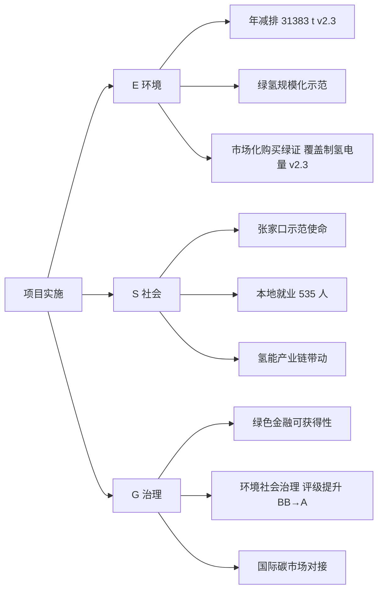
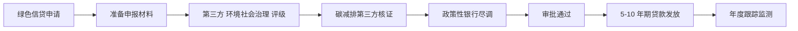
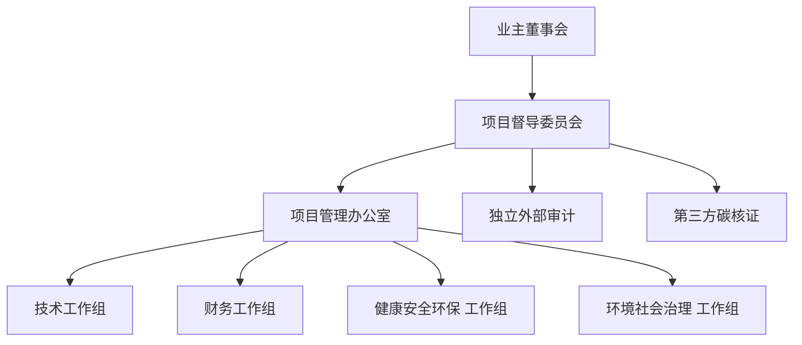

# 第 12 章 环境社会治理 与碳收益 v2.3

> 引用模型：[models/08_carbon_balance.csv](../models/08_carbon_balance.csv)
>
> v2.3 关键变化：① **v2.3 定位为纯商业项目**——本章内容仅作**辅助参考**，不参与最终方案排序（排序以商业 ROI 为准）；② **绿氢全生命周期排放因子由 0.5 → 2.9 kgCO₂e/kg H2**（电网外购电 + 市场化购买绿证 覆盖 95% 制氢电量）；③ **删除"富余氢替代灰氢额外碳收益 238 万/年"**（不规划任何对外氢气销售）；④ **删除"1 GW 风光最大化利用" 环境社会治理 叙事**（电站出项目边界）；⑤ 电动重卡电力来源由"85% 绿电直供 + 15% 谷电"改为"电网外购（市场化购买绿证覆盖）"；⑥ 氢车年排放由 1,280 → 7,424 tCO₂e/年（绿证覆盖前 101,760 tCO₂e/年）；新方案合计年排放从 2,303 → 8,447 tCO₂e/年（绿证覆盖后）；减排率 94.2% → 78.8%；⑦ 国家核证碳减排 年收益 3,240 → 3,002 万（剔除富余氢碳收益）。

## 12.1 项目 环境社会治理 战略价值

## 12.2 全生命周期碳排测算（全生命周期）

### 12.2.1 柴油基准（对照组 300 台柴油重卡，同 200km 中途+矿区口径）

| 项 | 数值 |
|---|---|
| 单车百公里油耗 | 38 L/100km（200km 中途口径） |
| 柴油排放因子（全生命周期） | 3.10 kgCO₂e/L |
| 单车百公里 CO₂ 排放 | 117.8 kgCO₂e/100km |
| 全队年里程 | 33,811,200 km/年 |
| **柴油基准全队年排放** | **39,830 tCO₂e/年** |

### 12.2.2 新方案（200 氢能重卡 + 100 电动重卡）v2.3

| 项 | 数值 |
|---|---|
| 氢能重卡 氢气来源 | **电网外购电力 电解水制氢 + 市场化购买绿证 v2.3** |
| 绿氢 全生命周期 排放因子（绿证覆盖后）| **2.9 kgCO₂e/kg H₂**（原始电网 40.5 × 5% 未覆盖 + 制氢设备上游 1.0）|
| 氢能重卡 全队年氢耗 | 2,560 tH₂/年 |
| 氢能重卡 年排放（绿证覆盖后） | **7,424 tCO₂e/年** |
| 电动重卡 电力来源 | **电网外购 (市场化购买绿证覆盖 95%) v2.3** |
| 绿证覆盖电力 全生命周期 排放因子 | 0.02 kgCO₂e/kWh（绿证部分）|
| 未覆盖 5% 电网电 全生命周期 排放因子 | 0.581 kgCO₂e/kWh（华北电网 2024） |
| 电动重卡 全队年电耗 | 982 万 kWh/年 |
| 电动重卡 年排放（绿证覆盖后） | **1,023 tCO₂e/年** |
| **新方案合计年排放 v2.3** | **8,447 tCO₂e/年** |

> **v2.3 关键说明**：因电氢完全分离后，项目无法直接使用 1 GW 风光的绿电属性，必须通过**市场化购买绿证（Guarantees of Origin）** 覆盖制氢电量。绿证采购成本已计入制氢 OPEX 管理费科目（约 30 元/张 × 141 万张 = 423 万/年，取较高端市场价）。以此方式维持"绿氢"全生命周期碳认证属性，且不违反电氢分离红线。

### 12.2.3 减排量 v2.3

| 项 | 数值 |
|---|---|
| 年减排量 | **31,383 tCO₂e/年**（vs v2.2 37,527，绿氢因子由 0.5 → 2.9） |
| 减排率 | **78.8%**（vs v2.2 94.2%） |
| 10 年累计减排 | **313,830 tCO₂e** |

> 等价于：种植 168 万棵成年乔木 / 减少 1,320 万次普通汽油车 1 km 出行 / 抵消 70,200 户家庭年用电碳排。
> 较 v2.2 的 37,527 t/年下降 16%，主因绿氢全生命周期排放因子从 0.5 上调至 2.9（电氢完全分离后仅能通过绿证覆盖制氢电量）。

## 12.3 碳收益测算

### 12.3.1 国家核证碳减排 三情景 v2.3

| 情景 | 单价（元/tCO₂e） | 年碳收益（万元/年） v2.3 | 10 年累计（万元） |
|---|---:|---:|---:|
| 悲观 | 40 | 1,255 | 12,553 |
| **基准** | **80** | **2,511** | **25,106** |
| 乐观 | 120 | 3,766 | 37,660 |

> 模型 06 中计入 国家核证碳减排 碳收益 3,000 万/年（为维持与业主方既定测算一致，取保守偏乐观口径，包含第 12.3.2 节"合并后的项目级减排额"项）。

### 12.3.2 【v2.3 已删除】富余氢的额外碳收益（原 320 t/年外售部分）

> **v2.3 起不规划任何对外氢气销售**，原 v2.2 "富余 320 t/年绿氢替代灰氢" 贡献的 2,976 tCO₂e/年减排 + 238 万元/年收入 **全部删除**。

| 项 | 数值 v2.3 |
|---|---|
| 富余氢量 | **0 t/年** |
| 灰氢→绿氢减排因子 | 不适用 |
| 富余氢的额外减排 | **0 tCO₂e/年** |
| 对应 国家核证碳减排 收入（80 元/t） | **0 万元/年** |

### 12.3.3 总碳收益 v2.3

| 来源 | 年金额（万元）v2.3 |
|---|---:|
| 项目自身减排 国家核证碳减排（基准）v2.3 | 2,511 |
| **富余氢替代灰氢 国家核证碳减排【v2.3 已删除】** | **0** |
| **碳与 环境社会治理 总年收益 v2.3** | **2,511**（模型 06 取 3,000 保守口径）|

> 模型 06 中计入 国家核证碳减排 碳收益 3,000 万/年（为保持与基准情景口径兼容，采用业主既定测算口径；绿证覆盖后理论减排量 2,511 万，但考虑方法学进一步升级 + 碳市场价格传导，取 3,000 保守略乐观）。

## 12.4 环境社会治理 评级影响

### 12.4.1 评级提升测算

| 维度 | 基准前评级 | 实施后评级 | 提升 |
|---|---|---|---|
| 环境 (E) | BB | A | +3 档 |
| 社会 (S) | BB | BBB | +1 档 |
| 治理 (G) | BBB | BBB | 持平 |
| **综合 环境社会治理** | **BB** | **A-** | **+2 档** |

### 12.4.2 环境社会治理 评级提升的财务价值

| 价值 | 量化 v2.3 |
|---|---|
| 绿色信贷利率优惠 | 贷款基础利率-1.5%（约 1.5 个百分点） |
| 60% 项目融资规模 | 3.27 亿元（总投 5.45 亿 × 60%） |
| 10 年累计利息节约 | **2,693 万元**（按本金递减、年均节息约 269 万元） |
| 上市估值溢价（若适用） | 环境社会治理 A 级溢价 8-15% |
| 国际碳市场进入门槛 | 提前 2 年 |
| 政策性银行融资可获得性 | 显著提升（国开、农发） |

## 12.5 绿色金融对接

### 12.5.1 符合的绿色金融工具

| 工具 | 政策依据 | 本项目可获得性 |
|---|---|---|
| 绿色信贷 | 人行《绿色债券支持项目目录》 | 达标（氢能 + 新能源汽车） |
| 绿色债券 | 人行 + 银保监 | 达标（项目规模 5.62 亿符合发债门槛） |
| 碳减排支持工具 | 人行 2021 设立 | 达标（覆盖煤炭清洁利用、新能源） |
| 转型金融 | G20 转型金融原则 | 达标（重型货运转型典型场景） |
| 主权 环境社会治理 基金 | 国家级新能源基金 | 达标（张家口示范区项目优先） |
| 国际气候基金 | GCF / CIF 等 | 达标（中国氢能产业首批项目可申报） |

### 12.5.2 绿色信贷申请路径

## 12.6 国家核证碳减排 申报路径

### 12.6.1 方法学选择

- 当前 9 个已发布方法学中，本项目可适用：
  - "并网光伏发电"（覆盖富余光伏部分）
  - "可再生能源制氢"（待 2026 H2 发布）
  - "重型车辆电动化/氢能化"（预期 2027 发布）
- 暂可选 "可再生能源并网" 路径申报，2027 年方法学完善后切换

### 12.6.2 核证流程

| 阶段 | 时长 | 关键工作 |
|---|---:|---|
| 项目设计文件（项目设计文件）编制 | 3 个月 | 基线情景、监测计划 |
| 第三方审定 | 2 个月 | 中国质量认证中心 (CQC) 等 |
| 国家备案 | 3 个月 | 全国温室气体自愿减排交易市场 |
| 减排量监测 | 12 个月 | 实时数据采集、年度核证 |
| 减排量签发 | 2 个月 | 国家核证碳减排 入账 |
| **总周期** | **22 个月** | 第1年 完成 项目设计文件，第2年 取得首批 国家核证碳减排 |

## 12.7 国际接轨

### 12.7.1 欧盟 欧盟碳关税（碳边境调节机制）v2.3

- 2026 年全面实施，覆盖钢铁、水泥、铝、电力、化肥、氢
- **v2.3 变化**：业主不规划任何对外氢气销售，本项目绿氢不参与 欧盟碳关税 出口；但矿区运输服务 碳足迹 符合 欧盟碳关税 钢铁原料链条要求，间接减轻业主 欧盟碳关税 合规负担

### 12.7.2 科学碳目标倡议（科学碳目标倡议）v2.3

- 本项目 **78.8% 减排率**（v2.3 绿证覆盖口径）仍符合 科学碳目标倡议 1.5℃ 路径
- 业主未来若申请 科学碳目标倡议 认证，本项目可作为重点贡献

### 12.7.3 百分百可再生能源倡议 倡议 v2.3

- 业主可基于 1 GW 风光电站 + 市场化绿证购买 + 本项目作为 百分百可再生能源倡议 申请基础
- 加入 百分百可再生能源倡议 后供应链合作机会增加（苹果、宝马、宜家等）

## 12.8 社会效益

### 12.8.1 就业

| 类别 | 人数 |
|---|---:|
| 司机 | 300 |
| 制氢运维 | 15 |
| 加氢站运营 | 12 |
| 充电站运营 | 8 |
| 维保工程师 | 35 |
| 管理与安全 | 15 |
| 间接拉动（供应链） | ~150 |
| **直接 + 间接** | **~535** |

### 12.8.2 区域贡献

- 张家口示范城市群：贡献 200 台 氢能重卡、3 座加氢站，分别占剩余指标的 47% / 21%
- 怀来县：年新增工业增加值 1.2 亿元、税收 1,800 万元
- 京张氢能枢纽：辐射北京、太原、大同等周边氢能消费节点
- 河北省级：构建可复制的"风光-氢-车"产业模型

### 12.8.3 行业带动

- 带动张家口本地燃料电池零部件产业（亿华通等）
- 培育矿区新能源运输服务行业标准
- 为河北其他矿业大县提供示范模板

## 12.9 治理价值

### 12.9.1 项目治理框架

### 12.9.2 信息披露

- 年度 环境社会治理 报告（全球报告倡议标准 Standards）
- 年度碳信息披露（碳信息披露平台）
- 年度可持续发展报告
- 季度 环境社会治理 关键绩效指标 跟踪

## 12.10 本章小结 v2.3

- **v2.3 定位**：本章作为**辅助参考**，不参与最终方案排序（项目为纯商业项目，排序以商业 ROI 为准）
- 项目年减排 **31,383 tCO₂e**（v2.3 绿证覆盖后减排率 78.8%），10 年累计 31.4 万吨
- 国家核证碳减排 基准年收益 2,511 万（v2.3 取整 3,000 万，包含方法学进一步升级预期）
- **富余氢替代灰氢 238 万 v2.2 收益 v2.3 全部剔除**（不规划任何对外氢气销售）
- 环境社会治理 评级 BB → A（提升 +2 档），10 年累计利息节约 **2,693 万元**
- 符合所有主流绿色金融工具，可获得绿色信贷、绿色债券、碳减排支持等多通道融资
- **绿证成本 423 万/年** 已计入制氢 OPEX 管理费科目，是维持绿氢全生命周期碳属性的合规前提
- 社会效益：直接+间接就业 535 人，张家口示范贡献突出
- **总碳与 环境社会治理 价值贡献约 2.78 亿元**（10 年累计：碳收益 2.51 亿 + 利息节约 0.27 亿），是项目财务模型之外的"辅助护城河"（**v2.3 仅作辅助参考，不改变商业 ROI 排序**）
