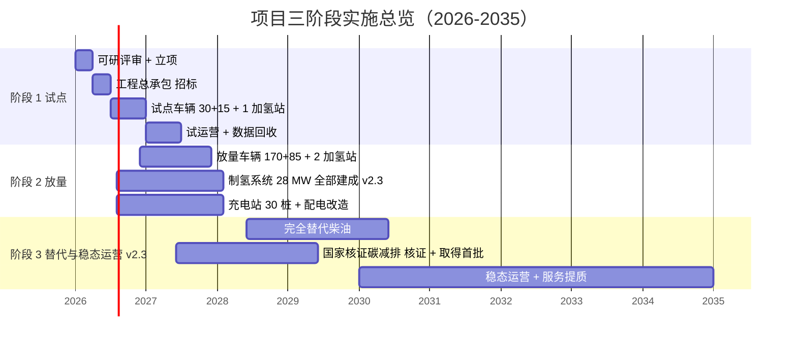
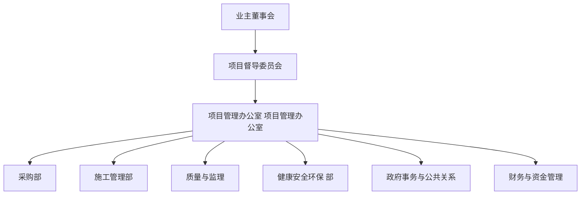
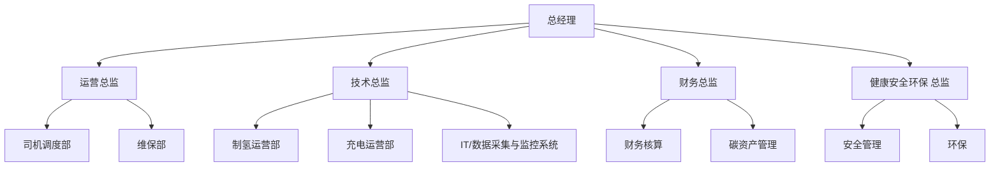
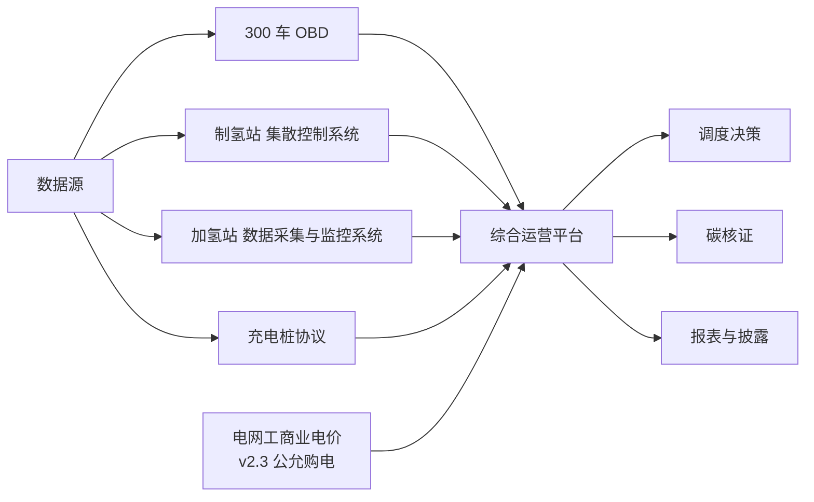
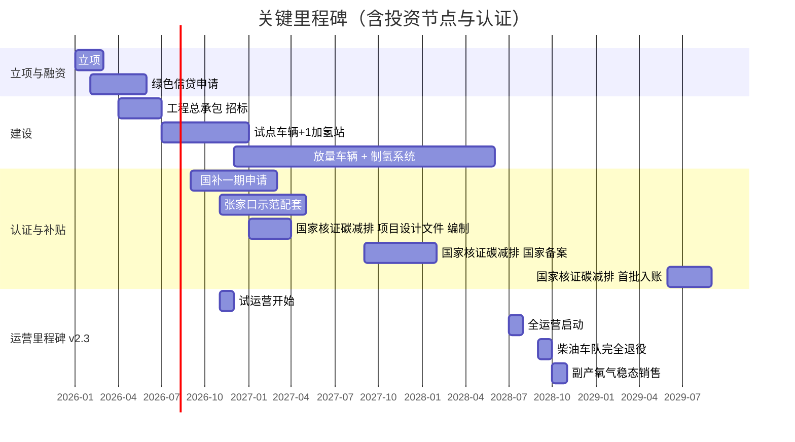

# 第 13 章 实施路径与里程碑 v2.3

> v2.3 关键变化：① **制氢系统装机 30 → 28 MW**（严格按车队需求 110% 反推）；② **删除"阶段 3 启动富余氢外售"任务**（业主不规划任何对外氢气销售）；③ 所有"富余氢外售"里程碑标记为【v2.3 已删除】；④ 阶段 1 电解槽装机 10 → 8 MW、阶段 2 制氢系统补建 20 → 20 MW（累计 28 MW）；⑤ 数据互联架构删除"1 GW 风光出力"作为制氢联动信号（电站出项目边界，不参与制氢/充电调度）。

## 13.1 三阶段实施总览

## 13.2 阶段 1：试点期（第1年，2026-01 ~ 2026-12）

### 13.2.1 阶段目标

- 完成可研、立项、工程总承包 招标
- 部署 **30 台 氢能重卡 + 15 台 电动重卡 + 1 座加氢站 + 8 MW 电解槽 + 10 台超充**（v2.3 起始规模维持不变）
- 启动试运营，回收 6 个月真实数据
- 取得国家燃料电池示范期奖励首批资金、张家口示范配套首笔补贴

### 13.2.2 关键里程碑

| 月份 | 里程碑 | 关键产出 |
|---|---|---|
| 2026-01 | 可研报告 v1.0 评审通过 | 立项决议 |
| 2026-02 | 项目立项申请 | 发改委批复 |
| 2026-03 | 资金筹措完成 | 绿色信贷 + 自有资金到位 |
| 2026-04 | 工程总承包 招标启动 | 招标公告发布 |
| 2026-06 | 工程总承包 中标 + 主设备订货 | 设备订单签约 |
| 2026-07 | 试点车辆首批到货 | 30 氢能重卡 + 15 电动重卡 入场 |
| 2026-08 | 8 MW 电解槽安装 | 调试启动 |
| 2026-10 | 加氢站-01 加氢站建成 | 投入运行 |
| 2026-11 | 试运营启动 | 首月数据采集 |
| 2026-12 | 第1年 总结评估 | 配比方案微调建议 |

### 13.2.3 阶段 1 投资

| 板块 | 金额（万元） |
|---|---:|
| 试点车辆（30 氢能重卡 ×30 万 + 15 电动重卡 ×45 万） | 1,575 |
| 8 MW 电解槽 + 电解槽配套设备 v2.3 | 4,000 |
| 1 座加氢站（加氢站-01，1,000 kg/天） | 2,160 |
| 10 台充电桩 + 部分配电 | 3,500 |
| 软投资（含可研/勘察/设计/前期） | 1,200 |
| **小计 v2.3** | **12,435** |

> 占总投资 22.8%（v2.3 总投资 5.45 亿）。

## 13.3 阶段 2：放量期（第2年-第3年，2027-01 ~ 2028-06）

### 13.3.1 阶段目标

- 车辆全部到位：累计 **200 氢能重卡 + 100 电动重卡**
- **制氢系统全部建成：累计 28 MW v2.3**（严格按车队需求 110% 反推）
- 加氢站全部建成：累计 **3 座**
- 充电桩全部建成：累计 **30 台**
- 全队进入正式运营，柴油车队同步退役

### 13.3.2 关键里程碑

| 季度 | 里程碑 | 关键产出 |
|---|---|---|
| 2027-一季度 | 第二批车辆到货（70 氢能重卡 + 35 电动重卡） | 累计 100 氢能重卡 + 50 电动重卡 |
| 2027-二季度 | 加氢站-02 加氢站建成 + 20 MW 电解槽全开 | 累计 20 MW |
| 2027-三季度 | 第三批车辆到货（70 氢能重卡 + 35 电动重卡） | 累计 170 氢能重卡 + 85 电动重卡 |
| 2027-四季度 | 加氢站-03 加氢站建成 | 加氢站全部投运 |
| 2028-一季度 | **28 MW 电解槽全部建成 v2.3** | 制氢能力达成（2,816 t/年 严格匹配车队需求 + 10% 冗余） |
| 2028-二季度 | 配电改造完成、全部充电桩投运 | 充电体系建成 |

### 13.3.3 阶段 2 投资

| 板块 | 金额（万元）v2.3 |
|---|---:|
| 放量车辆（170 氢能重卡 + 85 电动重卡） | 8,925 |
| 制氢系统补建（20 MW + 配套，累计 28 MW）v2.3 | 19,436 |
| 加氢站补建（加氢站-02 + 加氢站-03） | 4,320 |
| 充电与配电完成（含矿区换电站） | 5,934 |
| 土地与软投资 | 3,400 |
| **小计 v2.3** | **42,015** |

> 占总投资 77.2%（v2.3 总投资 5.45 亿）。

### 13.3.4 阶段 2 关键挑战

- **运量爬坡**：从试点 6 个月到放量后 18 个月运量从 50% → 100%
- **制氢-用氢匹配**：v2.3 按需反推后制氢规模 28 MW 严格匹配车队需求 + 10% 冗余，**不规划任何对外氢气销售**，制氢系统根据车队实时用氢调度，确保存储缓冲
- **司机培训**：300 名司机分批次完成 氢能重卡/电动重卡 操作认证
- **健康安全环保 管理**：新增 200+ 设备同步进入运营，安全管理压力大

## 13.4 阶段 3：替代与稳态运营期（第4年-第10年，2028-07 ~ 2035-12）v2.3

### 13.4.1 阶段目标 v2.3

- 完全替代柴油运输（柴油车队退役完毕）
- **【v2.3 已删除】启动富余氢的对外销售**（业主不规划任何对外氢气销售，制氢系统严格按车队需求运营）
- 副产氧气、绿证、国家核证碳减排 等合规副产收益稳态变现
- 取得 国家核证碳减排 核证并入账首批
- **评估扩能空间**（**仅在车队扩到 300→400 台时才考虑制氢扩能**，且扩能制氢规模仍按车队需求 ×110% 反推，**不包含"扩大规模对外氢销售"考虑**）

### 13.4.2 关键里程碑 v2.3

| 年份 | 里程碑 |
|---|---|
| 2028-三季度 | 柴油车队完全退役 |
| **2028-四季度** | **【v2.3 已删除】富余氢首单外售** |
| 2028-四季度 | 副产氧气稳态销售达 2.2 万吨/年 |
| 2029-二季度 | 国家核证碳减排 首批入账 |
| 2030-四季度 | 示范期补贴结束、过渡至常态运营 |
| 2031-一季度 | 扩能预研启动（**仅当车队扩至 400+ 台时启动，扩能制氢规模仍按车队需求反推**） |
| 2033-四季度 | 二期扩能（如批准）建成 |
| 2035-四季度 | 项目 10 年评价期结束、项目残值评估 |

### 13.4.3 阶段 3 关键运营 关键绩效指标 v2.3

| 关键绩效指标 | 年度目标 v2.3 |
|---|---|
| 单车年里程 | 氢能重卡 ≥ 128,000（中途）/ 电动重卡 ≥ 110,000（中途换电）/ 47,000（矿区倒短） |
| 单车出勤率 | ≥ 75% |
| 基准 LCOH（目标） | ≤ 22 元/kg（v2.3 基准 34.3 元/kg → PPA+国产化后目标）|
| 加氢站日加注量 | ≥ 1,200 kg/座 |
| 充电桩利用率 | ≥ 60% |
| **对外氢气销售** | **0 t/年（v2.3 不规划）** |
| **副产氧气销售率** | **≥ 95%**（22,528 t/年 应销售 ≥ 21,400 t）|
| 健康安全环保 事故率 | < 0.5 次/千万车·km |
| 环境社会治理 评级 | A- 及以上 |

## 13.5 工程总承包 招标策略

### 13.5.1 招标包划分

| 标段 | 内容 v2.3 | 预算（万元） | 推荐供应商 |
|---|---|---:|---|
| 标段 1：氢能重卡 | 200 台 49T 氢能重卡（30 万/台） | 6,000 | 福田/陕汽/东风 |
| 标段 2：电动重卡 | 100 台 49T 电动重卡（45 万/台） | 4,500 | 重汽/陕汽/解放 |
| **标段 3：制氢系统 v2.3** | **28 MW 电解槽 + 电解槽配套设备**（24 Alk + 4 PEM） | **23,436** | 阳光氢能/隆基/亿华通 |
| 标段 4：加氢站 | 3 座 1,000 kg/天 | 6,480 | 厚普/合众思壮/重塑 |
| 标段 5：充电体系 | 30 桩 + 1 座换电站 + 配电改造 | 9,434 | 特来电/星星充电/南瑞 |
| 标段 6：土建与配套 | 含场地/围墙/办公 | 2,300 | 当地施工总包 |
| 标段 7：监理 | 全过程监理 | 800 | 国家级监理资质 |
| **标段 8：氢相关综合险 v2.3** | 氢车 + 制氢 + 加氢站资产保险（首年集采） | **3,592/年** | 中再保 + 经纪人招标 |

### 13.5.2 关键技术要求

- 氢能重卡：燃料电池系统功率 ≥ 130 kW，质保 8 年/80 万 km，出勤率保证条款
- 电动重卡：电池循环次数 ≥ 3,000 次（80% 电池健康度），质保 8 年；中途车支持换电接口
- 电解槽：满负荷电耗 ≤ 4.7 kWh/Nm³，启停响应 ≤ 30 分钟
- 加氢站：日加注 1,500 kg @ 35 MPa，单次加注 ≤ 15 分钟
- 充电桩：480 kW 液冷超充，IP54 防护
- 氢相关综合险：含财产险 + 责任险 + 营业中断险，目标首年总费率 ≤ 5%，3 年内降至 ≤ 3%

## 13.6 组织架构

### 13.6.1 项目期组织

### 13.6.2 运营期组织

## 13.7 数字化建设

### 13.7.1 核心系统

| 系统 | 功能 | 价格（万元） |
|---|---|---:|
| 车辆调度系统（车队调度系统） | 全队任务排班、动态调度 | 200 |
| 充电调度系统（能源管理系统） | 充电峰谷优化、绿电匹配 | 150 |
| 制氢运营系统（集散控制系统+数据采集与监控系统）v2.3 | **28 MW 制氢全流程监控** | 含 一次性总投资 |
| 加氢站管理系统（加氢站管理系统） | 3 座加氢站统一管理 | 100 |
| 碳资产管理系统 | 国家核证碳减排 核证、环境社会治理 数据 | 80 |
| 综合运营平台（综合运营智能平台） | 全场景数据汇聚与决策 | 150 |
| **小计** | | **680**（已含于 年运营成本 L 板块） |

### 13.7.2 数据互联架构

> v2.3 注：删除 `1 GW 风光出力` 作为数据源节点 —— 风光电站出项目评价边界，不参与本项目的调度决策；本项目制氢/充电电力信号一律来自电网工商业电价。

## 13.8 关键里程碑甘特

## 13.9 风险预案与应急

| 阶段 | 主要风险 | 应急预案 |
|---|---|---|
| 试点期 | 工程总承包 延期 | 调整设备到货节奏，优先建加氢站 |
| 放量期 | 车辆质量问题 | 与车厂签订"出勤率保证条款"，故障车厂赔付 |
| **放量期 v2.3** | **制氢-用氢失衡** | **通过 28 MW 电解槽负荷率调节（30%-100% 可调）+ 储氢缓冲（≥ 3 天）消化波动；紧急情况下可临时购氢补充；不使用对外氢气销售作为对冲手段** |
| 替代期 | 柴油价回落 | 调整服务定价机制，强化碳收益 |
| 替代期 | 政策退坡 | 申报国家氢能综合应用试点 |
| **替代期 v2.3** | **电网工商业电价大幅上涨** | **推动风光长协 PPA 签约（目标 0.30 元/kWh）；启动国产化/材料替代降本；评估换装更节能的碱性电解槽（目标 ≤ 4.3 kWh/Nm³）** |

## 13.10 本章小结 v2.3

- 项目分为试点（第1年）→ 放量（第2年-第3年）→ 替代与稳态运营（第4年-第10年）三阶段
- **总建设期 24 个月，投资按 22.8% / 77.2% 分布于试点与放量阶段（v2.3 总投资 5.45 亿）**
- **制氢系统 v2.3 严格按 28 MW（车队需求 ×110%）反推，不做任何对外氢气销售规划**
- 工程总承包 分 8 个标段招标，覆盖全部主设备与配套（含氢相关综合险集采 v2.3 3,592 万元/年）
- 项目期与运营期组织架构清晰，项目管理办公室 + 双总监制运行
- **数字化系统 v2.3 数据互联架构删除"1 GW 风光出力"节点 —— 风光电站出项目边界，不参与本项目调度**
- **阶段 3 v2.3 删除"启动富余氢外售"里程碑**，新增"副产氧气稳态销售"里程碑（95% 销售率）
- 各阶段风险预案完备，**v2.3 新增"电网电价上涨"风险 → 推动风光长协 PPA 签约作为核心商业对冲**
