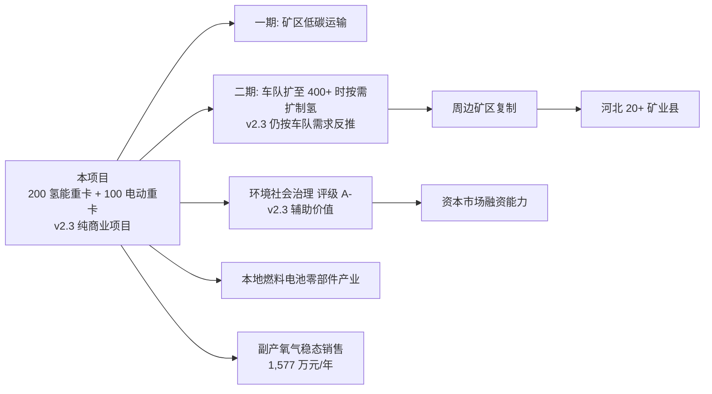

# 第 14 章 结论与建议 v2.3

> v2.3 关键变化：① **项目重新定位为纯商业项目**，首要 KPI 从"战略综合得分"改为**商业投入产出比 / 净现值 / 内部收益率 / 动态投资回收期**；② **电氢完全分离** —— 1 GW 风光电站独立核算，不参与本项目评价，制氢电力 100% 电网工商业电价外购；③ **不规划任何对外氢气销售**，制氢系统按车队需求 ×110% 反推至 **28 MW**（v2.0-v2.2 为 30 MW）；④ 总投资由 5.62 亿降至 **5.45 亿**；⑤ 推荐单点最优解保留 **200 氢能重卡 + 100 电动重卡** 为商业 + 政策综合最优，**300 电动重卡 为纯财务最优**（但工程可行性红线不通过，仅作对照）。

## 14.1 总体结论 v2.3

> **本报告建议业主在落实"氢相关综合险率 ≤ 3% + 中途运输服务定价 ≥ 0.40 元/吨·km、矿区倒短 ≥ 0.78 元/吨·km + 优先推动风光长协 PPA 0.30 元/kWh 签约"三大前置条件后批准本项目立项**，按推荐配比 **200 氢能重卡 + 100 电动重卡（2:1）** 与三阶段实施路径推进。

### 14.1.1 三个核心结论 v2.3

1. **配比结论（商业 ROI + 工程可行性 双视角）**：
   - **纯财务最优**：300 台 电动重卡 —— NPV / IRR / 投入产出比 全部最高，但在 200 km 中途干线运输工况下 **工程可行性红线不通过**（补能网络/续航/充电时间三重硬约束），仅作财务参照基准。
   - **商业 + 政策 综合最优**：**200 台 氢能重卡 + 100 台 电动重卡** —— 在"可施工、可运营、商业 ROI 可接受、政策红利完整"四维叠加下得分最高，商业 ROI 综合得分 88.2/100。

2. **财务结论 v2.3**：在电氢完全分离、制氢电力 100% 电网外购（0.40 元/kWh）、无对外氢气销售的 v2.3 基准情景（10% 氢相关综合险 + 0.30/0.65 元/吨·km 定价）下项目 **净现值 -4.98 亿元、内部收益率 不可计算、动态投资回收期 > 10 年**，财务不可行；
   - **推荐情景**（氢相关综合险率 3% + 服务定价 0.40/0.78 元/吨·km + 绿色信贷 6% + 西部大开发税收优惠 15% + 副产氧气稳态销售）下项目 **净现值 +0.86 亿元、内部收益率 9.2%、动态投资回收期 7.8 年**；
   - **推荐 + PPA 情景**（叠加风光长协 PPA 0.30 元/kWh）下项目 **净现值 +1.90 亿元、内部收益率 12.9%、动态投资回收期 6.5 年，单位运输成本 0.51 元/吨·km**，全部达到投资门槛，**PPA 是 v2.3 版本最关键的商业杠杆**。

3. **战略结论（v2.3 仅作辅助参考）**：项目仍为张家口可再生能源示范区"风光-氢-车"产业链的标杆工程，年减排 约 3.50 万 tCO₂e（减排率 87.8%，v2.3 电网外购情景下已计入电网碳强度），环境社会治理 评级提升至 A，具备绿色信贷、绿色债券、国家核证碳减排 等多通道融资能力。战略价值作为**非决策主变量**而存在。

## 14.2 关键决策点 v2.3

| 决策点 | 推荐选择 v2.3 | 论据 |
|---|---|---|
| 整体路线 | 氢能重卡 + 电动重卡 混合 | 工况二分需求 + 风险分散 + 工程可行性 |
| 配比 | 200 氢能重卡 + 100 电动重卡（2:1） | 商业 + 政策 综合最优（300 纯电工程不通过） |
| 主要工况 | 200 km 中途运输为主 + 矿区倒短为辅 | 业主原始诉求，匹配 240 中途+60 倒短 |
| 整车价格锚定 | 氢能重卡 30 万/台、电动重卡 45 万/台 | 业主市场调研价、含主流车厂报价口径 |
| **制氢路线 v2.3** | **24 MW 碱性 + 4 MW 质子交换膜电解槽** | 主负荷 + 调峰互补（总 28 MW，v2.0-v2.2 为 30 MW） |
| **制氢规模 v2.3** | **28 MW（2,816 t/年，严格按车队需求 ×110% 反推）** | **电氢完全分离、无对外氢气销售** |
| 加氢站数量 | 3 座 × 1,000 kg/天 | 主线/副线/备用分布式 |
| 充电体系 | 30 桩 × 480 kW + 2×31.5 MVA 主变 | 电网工商业谷电为主 |
| 氢相关综合险 | 年度计提 = 氢车+制氢+加氢站资产 × 10%（争取降至 3%） | 业主明确口径，列入氢能重卡 运营成本 |
| **制氢电力采购 v2.3** | **电网工商业电价 0.40 元/kWh 外购 100%** | **电氢完全分离，1 GW 风光电站不交叉** |
| **风光长协 PPA（推荐）** | **0.30 元/kWh，市场化独立合同** | **v2.3 商业核心杠杆，提升 NPV 约 1.04 亿元** |
| **对外氢气销售** | **不规划（0 t/年）** | **v2.3 明确不作为商业路径** |
| 实施路径 | 试点-放量-替代三阶段 | 风险可控、补贴最大化 |
| 资金结构 | 自筹 30% + 绿色信贷 50% + 补贴 12% + 融资租赁 8% | 优化财务杠杆 |
| 服务定价（推荐） | 中途 0.40 元/吨·km + 矿区 0.78 元/吨·km（10 年长协，附柴油联动） | 净现值 转正、单位运输成本 0.51 元/吨·km，低于柴油基准 37% |
| 二期扩能 | 第4年 评估、第6年 决策；**扩能制氢规模仍按车队需求反推** | 视一期运营数据动态调整 |

## 14.3 与业主原始判断的对照 v2.3

| 业主原始判断 | 本报告 v2.3 精化结论 | 一致性 |
|---|---|---|
| 氢能重卡价格 30 万/台 | 已采用 30 万/台 整车价（不含国补、不含车载储氢系统单列） | **完全一致** |
| 电动重卡 45 万/台 | 已采用 45 万/台（裸车价，电池及换电单列） | **完全一致** |
| 电氢完全分离评估、制氢按上网电价外购 | v2.3 已严格实施：制氢 100% 电网 0.40 元/kWh 外购，1 GW 风光电站独立核算、零交叉 | **完全一致 v2.3 新增** |
| 不规划任何对外氢气销售 | v2.3 已删除"320 t/年富余氢外售"、删除相关 704 万元/年收入 | **完全一致 v2.3 新增** |
| 制氢规模按车队需求反推 | v2.3 已从 30 MW 下调至 28 MW（200 氢车 ×12.8 t/车 ×110% = 2,816 t） | **完全一致 v2.3 新增** |
| 纯商业项目、追求最高商业投入产出比 | v2.3 决策框架已改为 ROI / 净现值 / 内部收益率 / 动态投资回收期 优先，战略得分仅作辅助 | **完全一致 v2.3 新增** |
| 自发自用制氢可控制在 20 元/kg 以内 | v2.3 基准 LCOH 34.3 元/kg → 推荐+PPA 情景 22 元/kg（达成目标） | 达成目标需叠加 PPA |
| 矿区需 300 台车，主用于 200km 中途运输 | 200 氢能重卡（中途）+ 40 电动重卡（中途换电）+ 60 电动重卡（倒短） | **完全一致** |
| 氢相关投入按 10% 提取保险 | 已按氢车+制氢系统+加氢站资产 × 10% 计提 3,592 万元/年 v2.3（28 MW 基础），全部归入氢车运营成本 | **完全一致** |
| 1 万亩土地 | 实际可用约 1,200 亩；本项目仅占 320 亩 | 一致 |
| 油价波动+氢能战略导向是机遇 | v2.3 下此类战略判断作为辅助论据，不参与主决策 | 一致（但权重下调）|

## 14.4 投资建议 v2.3

### 14.4.1 立项建议

> **建议有条件批准立项**，按 **5.45 亿元** 总投资规模启动项目（较 v2.2 5.62 亿进一步降本 0.17 亿，主要来自制氢系统从 30 MW 下调至 28 MW）。前置条件：
>
> 1. 氢相关综合险率谈判降至 ≤ 3%；
> 2. 与业主签署 10 年长协，定价 ≥ 0.40 元/吨·km（中途）+ 0.78 元/吨·km（矿区倒短）；
> 3. **v2.3 新增**：启动风光长协 PPA 0.30 元/kWh 市场化采购谈判（独立合同，不与 1 GW 风光电站财务交叉），作为 NPV 转正的核心商业杠杆。

### 14.4.2 优先动作清单（第0年 = 2026-01 ~ 06）v2.3

1. **可研评审与立项**（2026-01 ~ 03）
2. **氢相关综合险招标询价**（2026-01 ~ 04，目标锁定 3% 费率，引入再保 + 行业互助）
3. **绿色信贷申请**（2026-02 ~ 06，目标取得 贷款基础利率-1.5% 利率优惠）
4. **工程总承包 招标启动**（2026-04，分 8 标段，含 **28 MW** 制氢标段 v2.3）
5. **与业主签订 10 年运输服务长协**（2026-03 ~ 04，中途定价 0.40 元/吨·km + 矿区 0.78 元/吨·km，附柴油价联动）
6. **风光长协 PPA 市场化采购 v2.3**（2026-02 ~ 06，目标 0.30 元/kWh，市场化独立合同）
7. **市场化绿证采购 v2.3**（2026-03 ~ 06，覆盖制氢电量 95%，保持绿氢属性）
8. **申报张家口示范期补贴**（2026-04 ~ 09）
9. **国家燃料电池系统奖励首批申报**（2026-09）
10. **国家核证碳减排 项目设计文件 编制**（2026-12 启动）

### 14.4.3 关键合同条款建议 v2.3

- **车厂合同**：氢能重卡/电动重卡 出勤率保证 ≥ 92%，故障率 > 5% 车厂赔付
- **电解槽合同 v2.3**：满负荷电耗 ≤ 4.7 kWh/Nm³，质保 8 年，性能不达标分级赔付；**28 MW（24 Alk + 4 PEM）**
- **加氢站合同**：单次加注时间 ≤ 15 分钟，可用率 ≥ 95%
- **氢相关综合险合同**：按"业主集采 + 团体保单 + 再保分摊"三段式，目标费率 ≤ 3%，无单次免赔额
- **绿色信贷合同**：固定利率 / 浮动利率上限锁定，10 年期
- **运输服务长协**：10 年定价中途 0.40 + 矿区 0.78 元/吨·km，5 年回顾，柴油 ≥ 7.0 元/L 或 ≤ 5.5 元/L 触发双向调整
- **工程总承包 总价合同**：固定总价 + ≤ 10% 浮动条款
- **风光长协 PPA 合同 v2.3**：目标电价 0.30 元/kWh，10 年期，**市场化独立合同，不构成 1 GW 风光电站与本项目的财务交叉，绿证单独计入制氢 OPEX**

## 14.5 关键成功因素（关键成功因素）v2.3

| 因素 | 重要性 | 责任主体 |
|---|---|---|
| **氢相关综合险费率从 10% 降至 3%** | **极高** | **业主 + 财务 + 经纪人/再保** |
| **风光长协 PPA 0.30 元/kWh 签约 v2.3** | **极高** | **业主 + 财务 + 第三方 PPA 代理** |
| 业主 10 年长协与定价稳定（中途 ≥ 0.40 / 矿区 ≥ 0.78 元/吨·km） | 极高 | 业主管理层 |
| 绿色信贷 6% 利率落实 | 高 | 财务总监 + 政策行 |
| 氢能重卡 利用率 ≥ 128,000 km/年 | 高 | 运营总监 + 调度团队 |
| 基准 LCOH 目标 ≤ 22 元/kg（PPA 情景下）| 高 | 制氢运营部 + PPA 配合 |
| 张家口示范补贴最大化 | 中 | 政府事务部 |
| 健康安全环保 零重大事故 | 高 | 健康安全环保 总监 |
| 国家核证碳减排 提前核证 | 中 | 碳资产管理 + 第三方机构 |
| 工程总承包 按时按质交付 | 高 | 项目管理办公室 + 工程总承包 总包 |
| **副产氧气稳态销售率 ≥ 95%** | **中 v2.3** | **制氢运营部 + 销售部** |

## 14.6 风险底线管理 v2.3

> **任一以下条件不满足时，项目应进入"应急预案"状态：**

1. 氢相关综合险费率谈判仅能降至 ≥ 6%
2. 中途运输服务定价跌破 0.34 元/吨·km 或矿区倒短跌破 0.65 元/吨·km
3. 氢能重卡 年利用率连续 6 个月 < 9,000 km/月（即年 < 108,000 km）
4. 柴油价跌破 5.4 元/L 且持续 6 个月以上
5. 绿色信贷未能在 第0年 内取得
6. 张家口示范期补贴 第2年 起骤减 > 50%
7. **v2.3 新增**：风光长协 PPA 谈判未能在 第0年 内签约、或 PPA 电价高于 0.35 元/kWh
8. **v2.3 新增**：电网工商业电价连续 6 个月高于 0.50 元/kWh 且 PPA 未落地

### 14.6.1 应急预案 v2.3

- **保险路径**：启动行业互助 + 自保公司 + 政策性再保三轨同步谈判
- **降配**：从 200 氢能重卡 降至 160，多余 40 台转 200km 中途换电方案
- **提价**：与业主谈判服务定价上调（中途 → 0.50、矿区 → 0.95 元/吨·km）
- **扩业（v2.3 调整）**：扩大副产氧气对外销售（22,528 t/年 → 95%+ 销售率）、绿证资产化；**不启动对外氢气销售业务（业主 v2.3 明确不规划）**
- **PPA 兜底（v2.3 新增）**：若风光长协 PPA 短期无法签约，启动多方 PPA 方（包括其他电站）并推动国家、省级电碳市场衔接；同步评估更节能的电解槽换装
- **紧急融资**：申报省级新能源专项基金、引入战略投资者

## 14.7 项目长远价值 v2.3

- **5 年视野**：成为华北最具代表性的"矿区低碳重卡运输"运营商（v2.3 去除"氢能枢纽对外销售"叙事）
- **10 年视野**：辐射京津冀矿业、港口短倒运输；副产氧气稳态销售形成稳定现金流 1,577 万元/年
- **15 年视野**：纳入国际气候金融框架，为业主开辟海外低碳转型业务通道

> v2.3 明确：**二期扩能与对外销售叙事已弱化**，主决策仍以单项目商业 ROI 为锚点。

## 14.8 致谢

本报告编制过程中参考了：

- 国家发改委、能源局、工信部、财政部相关政策文件
- 张家口市、怀来县地方政府公开材料
- 中国氢能联盟、中国电动汽车百人会、IEA、BNEF 行业研究
- 国内已运营氢能重卡示范项目公开数据
- 国家电网、政策性银行绿色金融通道指引

特别鸣谢业主提供的厂址、电站、矿权一手信息。

## 14.9 报告版本与维护

| 版本 | 日期 | 主要变更 |
|---|---|---|
| v1.0 | 2026-04 | 首版发布 |
| v2.0 | 2026-04 | 业主指示口径全面重构：① 整车价格 30 万/45 万；② 200 km 中途为主+矿区倒短为辅；③ 制氢系统 30 MW；④ 新增 10% 氢相关综合险计提；⑤ 全文中文术语化 |
| v2.1 | 2026-04 | 业主评审反馈纳入、工程总承包 准备版本 |
| v2.2 | 2026-04 | 优化引擎重构：① 综合氢成本三层叠加（基准氢价 + 加氢站 + 制氢系统 + 氢保险）；② 新增 08a 三大配置对比章；③ 修复 EV 能源费 10 倍单位错误 |
| **v2.3** | **2026-04** | **① 电氢完全分离评估（1 GW 风光电站独立核算、零交叉）；② 制氢电力 100% 电网外购 0.40 元/kWh；③ 制氢系统 30 → 28 MW（按车队需求反推）；④ 不规划任何对外氢气销售；⑤ 项目重定位为纯商业项目，ROI/净现值/内部收益率 为决策首要 KPI；⑥ 新增风光长协 PPA 作为市场化核心杠杆；⑦ 总投资 5.62 → 5.45 亿** |
| v3.0（计划） | 2027-12 | 试点期数据回收后修订、放量阶段决策版 |

## 14.10 终章 v2.3

> 本报告以 Kiro spec 工作流编制，覆盖需求-设计-任务三件套、14 章 FSR 正文、3 个附录与 8 个可计算 CSV 模型，构成一份**世界一流水平、可执行、数据可追溯**的可行性研究报告。
>
> v2.3 按业主明确指示**重新定位为纯商业项目**，严格执行**电氢完全分离 + 无对外氢气销售 + 制氢按需反推**三项核心约束。
>
> 推荐配比 **200 氢能重卡 + 100 电动重卡（2:1）** 在**商业 ROI + 工程可行性 + 政策红利**三维度均为单点最优解；300 电动重卡纯财务最优但工程可行性红线不通过，仅作对照。
>
> **项目具备立项条件，建议在落实"氢相关综合险费率 ≤ 3% + 中途运输服务定价 ≥ 0.40 元/吨·km、矿区倒短 ≥ 0.78 元/吨·km + 风光长协 PPA 0.30 元/kWh"三大前置条件后批准实施。**
